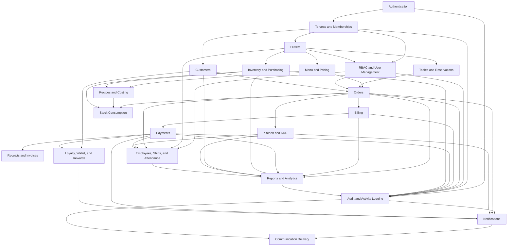

# Module Dependencies

## Dependency Principles

- Dependencies indicate required contracts, not permission to bypass module
  APIs or database ownership.
- Modules may read approved projections from upstream modules.
- Cross-module writes belong in an orchestrating service and one transaction
  when consistency is required.
- Event placeholders do not replace durable contracts.
- Circular module dependencies require an architecture decision.

## Core Dependency Map



## Module Ownership

| Module | Owns | Important upstream contracts |
|---|---|---|
| Auth | Credentials, access/refresh sessions | Global user identity |
| Tenants | Tenant lifecycle and membership boundary | Auth |
| Outlets | Outlet lifecycle and configuration | Tenants |
| RBAC | Tenant roles, permissions, user/outlet access | Auth, tenants, outlets |
| Menu | Categories, items, variants, add-ons, outlet prices | Tenants, outlets |
| Tables | Sections, tables, reservations, occupancy operations | Outlets |
| Orders | Commercial order aggregate and item snapshots | Menu, tables, customers |
| Kitchen | Station routing and preparation lifecycle | Orders, menu, outlets |
| Billing | Immutable bill and tax snapshots | Completed orders |
| Payments | Tenders, settlements, refunds, reconciliation | Bills |
| Receipts | Fiscal/receipt snapshots and print audit | Payments, bills |
| Inventory | Stock masters, balances, ledgers, purchasing | Outlets |
| Recipes | Recipe, yield, portion, and cost definitions | Menu, inventory |
| Consumption | Idempotent order-to-stock movements | Orders, recipes, inventory |
| Customers | Profiles, addresses, notes, visits, statistics | Tenants, outlets |
| Employees | Staff profiles, shifts, attendance, performance | RBAC, outlets, operations |
| Reports | Read models, aggregates, generation audit | Operational modules |
| Loyalty | Points, tiers, wallet, rewards, referrals | Customers, orders, payments |
| Audit | Immutable security and business activity events | All protected modules |
| Notifications | In-app notification intent, recipients, read state, preferences | Domain events, audit |
| Communication | External templates, providers, outbound snapshots, attempts, webhooks | Notifications, domain events, audit |
| Subscriptions | SaaS plans, entitlements, limits, invoices | Tenants, platform auth |
| Offline sync | Device operations, idempotency, cursors, conflicts | Operational APIs |

## Implementation Order

The default chain for a new feature is:

```text
identity and tenancy
  -> owning master data
  -> transaction aggregate
  -> settlement or ledger
  -> reporting/audit
  -> notification/integration
```

Use the module-specific document under `docs/specifications` for exceptions and
exact invariants.
