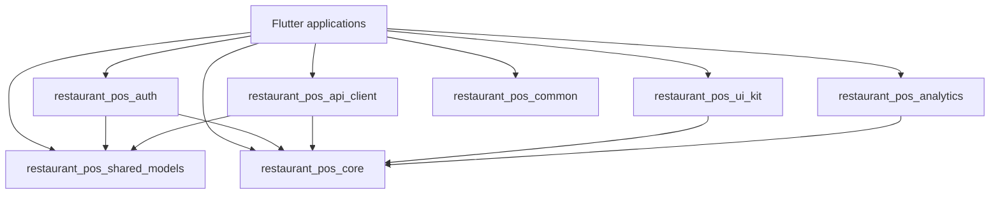

# Flutter Frontend Architecture

## Workspace

The repository uses a Dart pub workspace declared in the root `pubspec.yaml`.
Flutter applications live under `apps/`; reusable Dart and Flutter packages
live under `packages/`.

The standardized package identifiers are:

| Package | Responsibility |
|---|---|
| `restaurant_pos_core` | Configuration, errors, results, constants, and framework-independent utilities |
| `restaurant_pos_auth` | Authentication repository, token storage, auth state, and role-access contracts |
| `restaurant_pos_api_client` | Dio setup, interceptors, endpoint paths, and typed API services |
| `restaurant_pos_shared_models` | Backend-aligned auth, tenant, outlet, pagination, and shared domain models |
| `restaurant_pos_ui_kit` | Flutter themes, navigation, and reusable presentation primitives |
| `restaurant_pos_analytics` | Typed, privacy-safe analytics contracts |
| `restaurant_pos_common` | Small dependency-free validators and string utilities |

Legacy `serveiq_*` Dart barrel files remain temporary source-compatible
re-export shims. New code must import `package:restaurant_pos_*/...`.

## Dependency Direction



Packages never import application code. `core`, `common`, and
`shared_models` remain framework-independent. `ui_kit` is the only shared
package that requires Flutter.

## Feature Delivery

Flutter feature work starts only after business, database, authorization, and
API contracts exist. The client sequence is:

1. Add or update backend-aligned models in `shared_models`.
2. Add typed transport behavior in `api_client`.
3. Add authentication/session contracts in `auth` when required.
4. Implement Riverpod state and use cases inside the owning application.
5. Build screens from `ui_kit` primitives.

Widgets do not call Dio, Firebase, or SQLite directly. Client role checks control
presentation only; backend authorization remains authoritative.

## API Client

`restaurant_pos_api_client` uses the existing NestJS `/api/v1` base URL through
an injected `ApiClientConfig`. Endpoint constants are relative paths so
environments can choose their own host and API prefix.

Access tokens are supplied through `AccessTokenProvider`. Refresh-token rotation
and durable secure storage are orchestrated by application state using the
`restaurant_pos_auth` contracts. Transport errors are mapped to the common
`Failure` shape without logging credentials or response bodies.

## Models

Transport models use explicit `fromJson` and `toJson` methods. Timestamps are
normalized to UTC. Tenant and outlet status values and role strings match the
NestJS API contract. Money models must use integer minor units plus an ISO
currency code when financial contracts are introduced.

## Validation

Run from the repository root:

```powershell
flutter pub get
dart format --output=none --set-exit-if-changed apps packages
dart analyze
flutter test apps/restaurant-app
```
