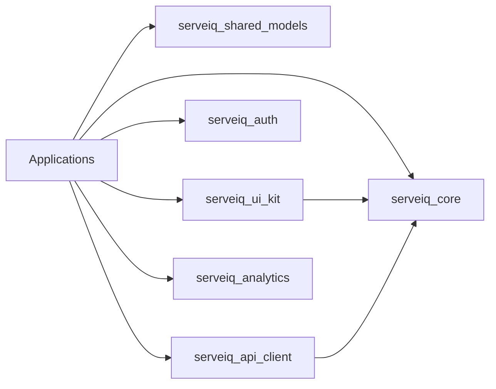

# AI-Friendly Monorepo Layout

## Deployable Applications

| Path | Ownership |
|---|---|
| `apps/restaurant-app` | Cashier, waiter, kitchen, and outlet operations |
| `apps/admin` | Restaurant owner and tenant administration |
| `apps/super-admin` | Platform tenant, subscription, support, and billing administration |
| `apps/customer` | Customer ordering, loyalty, rewards, wallet, and referrals |
| `apps/kitchen-display` | Future dedicated KDS client |

Only `apps/restaurant-app` currently contains executable application code.

## Workspace Packages

| Package | Current content |
|---|---|
| `serveiq_core` | App exception and currency formatting |
| `serveiq_shared_models` | Stable menu item contract |
| `serveiq_ui_kit` | Theme and shared navigation |
| `serveiq_auth` | Session/JWT/permission package boundary |
| `serveiq_api_client` | API transport package boundary |
| `serveiq_analytics` | Privacy-safe analytics package boundary |
| `serveiq_common` | Governed cross-domain package boundary |

The repository root `pubspec.yaml` defines the Dart workspace. Local packages use
`resolution: workspace`, and the root `pubspec.lock` is the reproducible
dependency lock.

## Dependency Rules

- Packages never import application code.
- One application never imports another application's `lib`.
- Shared models are transport-neutral and framework-independent.
- UI kit code contains no restaurant business logic.
- Firebase remains an application data-source implementation until NestJS auth
  provides a stable shared contract.
- Empty package boundaries must not accumulate unrelated utility functions.

## Backend Boundary

`backend/api/src/modules` documents the intended NestJS domain ownership. No
executable backend was generated because the repository has no existing backend
behavior or approved database migration to preserve.

## AI Navigation Order

For repository tasks, inspect in this order:

1. `docs/specifications/enterprise-system-design.md`
2. `docs/architecture/monorepo-layout.md`
3. The owning application or backend module README
4. Package public barrel files
5. Feature-level data/domain/presentation folders

This limits cross-boundary edits and keeps generated changes aligned with domain
ownership.
