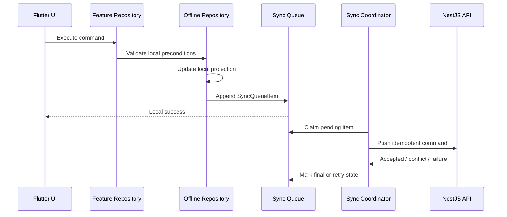

# Offline Sync Architecture

## Status

Implemented through Task 33.2.

This document defines the offline architecture boundary. SQLite projection
storage exists for Task 33.2. Sync workers, background scheduling, conflict
resolution, and offline POS flows remain deferred.

## Goals

Offline operation must allow restaurant devices to continue approved operations
when connectivity is unavailable, then synchronize without silently losing or
overwriting data.

The offline capability is a platform layer:

```text
Flutter UI
  -> feature repository
  -> offline repository facade
  -> SQLite projection and sync queue
  -> sync coordinator
  -> typed API client
  -> NestJS domain APIs
  -> PostgreSQL
```

Business modules continue to own business rules. The offline layer owns local
persistence, queued command durability, sync state, checkpoints, retries,
conflict tracking, and recovery workflows.

## Device Scope

Every offline record must carry:

* `tenantId`
* `outletId`
* `deviceId`
* actor user identity where the operation is user initiated
* business timestamp or `businessDate` where the domain requires it

Offline mode is permitted only on previously authenticated trusted devices. It
does not grant permissions. Backend authorization remains authoritative when
queued commands are synchronized.

## Identifier Strategy

Offline-created records use globally unique identifiers before they reach the
server. The identifier must be stable across retries and must not be replaced
after synchronization.

Required identifier metadata:

* `id`
* `tenantId`
* `outletId`
* `deviceId`
* `createdAt`

Queued commands also include a stable `idempotencyKey`. Retrying the same
operation reuses the same key.

## Local Persistence Boundary

Task 33.2 defines the first local SQLite tables in
`apps/restaurant-app/lib/core/offline`:

* `device_sync_state`
* `local_orders`
* `local_bills`
* `local_customers`
* `local_inventory_items`

The tables preserve tenant, outlet, and device scope, store globally stable
local IDs, and keep source payload JSON so future sync tasks can avoid lossy
projection changes.

Future approved table groups are:

* `SyncQueue`
* `SyncBatch`
* `SyncConflict`
* `SyncCheckpoint`
* `LocalChangeLog`

Task 33.2 intentionally does not implement sync queue mutation, local change
tracking, background workers, or conflict handling.

## Command Flow



Local command acceptance is not the same as server acceptance. The UI must make
pending sync state visible for operationally important records.

## Pull Flow

The sync coordinator pulls server changes using a checkpoint cursor:

```text
SyncCheckpoint(cursor)
  -> pull bounded server changes
  -> apply local projection transactionally
  -> update cursor after successful apply
```

Cursors are tenant, outlet, device, and module scoped.

## Queue State Model

Supported queue states:

* `PENDING`
* `IN_PROGRESS`
* `SUCCESS`
* `FAILED`
* `CONFLICT`
* `RETRYING`

Failed synchronization never deletes local records. Queue entries are
append-only for audit and recovery. Later tasks may compact successful entries
only after durable audit and checkpoint guarantees exist.

## Conflict Principles

Conflict resolution priority:

1. explicit business rule
2. server authority
3. manual review
4. last write wins only when explicitly approved

Financial records, inventory ledgers, loyalty ledgers, fiscal records, and
audit history must not use automatic overwrite behavior.

## Payment Strategy

Offline payment verification modes:

* `MANUAL`
* `GATEWAY`
* `OFFLINE`

Offline payment verification statuses:

* `PENDING`
* `VERIFIED`
* `FAILED`

Cash, manually verified UPI, manually verified card, and manually verified bank
transfer records may be marked `VERIFIED` offline. Gateway payments remain
`PENDING` until online verification completes.

## Shared Contracts

Task 33.1 adds framework-independent Dart contracts in
`packages/shared_models/lib/src/offline/offline_sync_models.dart`:

* `OfflineIdentifier`
* `DeviceSyncState`
* `SyncQueueItem`
* `SyncBatch`
* `SyncConflict`
* `SyncCheckpoint`
* `SyncPushRequest`
* `SyncPullRequest`

These contracts are intentionally storage-neutral. Task 33.2 maps
`DeviceSyncState` and local read projections to SQLite.

## Non-Goals

Task 33.2 does not implement:

* sync queue mutation logic
* background workers
* conflict resolution
* offline POS command handling
* admin sync monitoring UI
