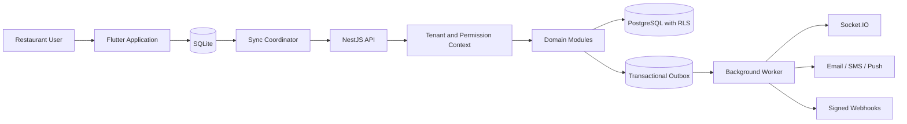

# System Overview

## Purpose

ServeIQ is a multi-tenant restaurant operating system designed to support:

- Point of sale and billing
- Dine-in, takeaway, delivery, and QR ordering
- Table and kitchen operations
- Inventory and procurement
- Customer relationship management and loyalty
- Multi-outlet and franchise management
- Reporting and analytics
- Subscription-based SaaS administration

The platform is designed to begin as a cost-efficient self-hosted system and
scale to multiple application servers and dedicated infrastructure without
rewriting its business domains.

## Current Implementation Status

| Component | Status |
|---|---|
| Restaurant Flutter application | Implemented prototype |
| Shared Dart/Flutter packages | Partially implemented |
| Tenant admin application | Scaffold only |
| Super-admin application | Scaffold only |
| Customer application | Scaffold only |
| Kitchen display application | Scaffold only |
| NestJS backend | Architecture scaffold only |
| PostgreSQL schema and migrations | Planned |
| SQLite offline database and synchronization | Planned |
| Deployment infrastructure | Planned |

The current executable application uses Firebase authentication temporarily.
Firebase is isolated behind repository and data-source boundaries and is not the
target system of record.

## Repository Architecture

```text
restaurant-pos/
  apps/
    restaurant-app/
    admin/
    super-admin/
    customer/
    kitchen-display/
  packages/
    core/
    auth/
    api_client/
    shared_models/
    ui_kit/
    analytics/
    common/
  backend/
    api/
    database/
    migrations/
    scripts/
  docs/
    architecture/
    api/
    database/
    business-rules/
    specifications/
  infrastructure/
```

The root `pubspec.yaml` defines a Dart workspace and provides one dependency
resolution and lockfile for the Flutter application and shared packages.

## Application Responsibilities

### Restaurant App

Used by cashiers, waiters, kitchen staff, and outlet managers.

Current capabilities:

- Firebase login with role-based screen selection
- Outlet dashboard prototype
- POS menu, cart, tax, and service-charge calculations
- Waiter and table-service prototype

Target capabilities:

- Orders, tables, kitchen, inventory, payments, and shift operations
- SQLite-backed offline operation
- Background synchronization with conflict handling
- Tenant, outlet, permission, and device-aware sessions

### Admin

Planned application for restaurant owners and tenant administrators:

- Outlet and employee management
- Menu, inventory, customer, loyalty, and report administration
- Consolidated multi-outlet dashboards

### Super Admin

Planned platform administration application:

- Tenant and subscription management
- Billing, support, feature flags, and platform analytics
- Fully audited tenant impersonation

### Customer

Planned customer-facing application:

- Ordering
- Loyalty points and rewards
- Wallet and gift cards
- Referrals and personalized offers

### Kitchen Display

Planned dedicated kitchen application:

- Station queues and ticket routing
- Preparation timers
- Item and order status progression
- Real-time operational alerts

## Flutter Architecture

Each Flutter application follows feature-first organization:

```text
lib/
  core/
  shared/
  features/
    feature_name/
      data/
      domain/
      presentation/
```

Dependency direction:

```text
presentation -> application/controllers -> domain
data/repository implementations ---------> domain
```

Rules:

- Widgets do not call Firebase, HTTP clients, or SQLite directly.
- Domain contracts do not depend on Flutter.
- Features do not import another feature's presentation code.
- Reusable cross-application code is exposed through package barrel files.
- Application-specific shared widgets remain in the owning application.

## Shared Packages

| Package | Responsibility |
|---|---|
| `serveiq_core` | Framework-independent errors and utilities |
| `serveiq_auth` | Shared identity, role, session, and permission contracts |
| `serveiq_api_client` | Planned API transport and generated clients |
| `serveiq_shared_models` | Stable cross-application domain contracts |
| `serveiq_ui_kit` | Flutter theme and reusable presentation components |
| `serveiq_analytics` | Planned privacy-safe analytics contracts |
| `serveiq_common` | Governed cross-domain primitives |

Packages must never import application code.

## Target Backend Architecture

The backend will use a modular NestJS monolith initially:

```text
backend/api/src/
  modules/
    auth/
    tenants/
    outlets/
    users/
    menu/
    inventory/
    orders/
    customers/
    loyalty/
    payments/
    reports/
    subscriptions/
  common/
  config/
  main.ts
```

Each module will separate:

- Presentation: controllers, gateways, and transport DTOs
- Application: use cases, authorization, transactions, and orchestration
- Domain: entities, value objects, invariants, events, and ports
- Infrastructure: PostgreSQL repositories and external integrations

The initial modular monolith keeps deployment and operations simple while
preserving boundaries for later service extraction.

## Multi-Tenant Model

The planned initial model uses one shared PostgreSQL schema:

- Every tenant-owned record includes `tenant_id`.
- Trusted authentication establishes tenant context.
- Repository filtering and PostgreSQL row-level security enforce isolation.
- Outlet-scoped authorization is evaluated independently from tenant isolation.
- Cache keys, jobs, files, socket rooms, and audit events include tenant scope.

Large or regulated tenants may later move to dedicated database shards behind
the same repository contracts.

## Offline-First Model

The restaurant app will use SQLite as its operational local store:

1. The UI reads reactive local projections.
2. Commands update local state and append a pending operation atomically.
3. A sync worker pushes operations with unique idempotency identifiers.
4. The server validates and acknowledges or rejects each operation.
5. Clients pull ordered changes using a resumable cursor.

Financial, inventory, loyalty, and audit changes use append-only ledger events.
The server remains authoritative for external payments, wallet balances, and
fiscal document numbering.

## Data and Integration Flow



## Security Model

Target controls include:

- Short-lived JWT access tokens
- Rotating refresh tokens stored securely
- Argon2id password hashing
- Optional MFA and step-up authentication
- Tenant and outlet-aware RBAC
- PostgreSQL row-level security
- Immutable, hash-chained audit events
- Idempotent financial and offline operations
- TLS, rate limiting, structured redacted logs, and encrypted sensitive fields

Client role checks control presentation only. The backend must independently
authorize every protected operation.

## Initial Deployment

The initial production environment targets one Ubuntu LTS VPS:

```text
Nginx
  -> Flutter Web assets
  -> NestJS API and Socket.IO under PM2
PostgreSQL
Local file storage
Background worker and scheduler
Encrypted off-host backups
```

The design does not require Docker, Kubernetes, managed databases, or cloud
object storage for the initial deployment.

## Scaling Path

1. Optimize the modular monolith and PostgreSQL indexes.
2. Separate workers and reporting workloads.
3. Add Redis for distributed sockets, caching, and rate limits.
4. Run multiple API servers behind a load balancer.
5. Move files to S3-compatible object storage.
6. Add PostgreSQL replicas, partitions, and tenant-aware sharding.
7. Extract only measured hotspots into independent services.

## Source Documents

- [Enterprise system design](../specifications/enterprise-system-design.md)
- [Monorepo layout](monorepo-layout.md)
- [Repository architecture audit](repository-architecture-audit.md)
- [Repository restructuring record](repository-restructuring.md)
