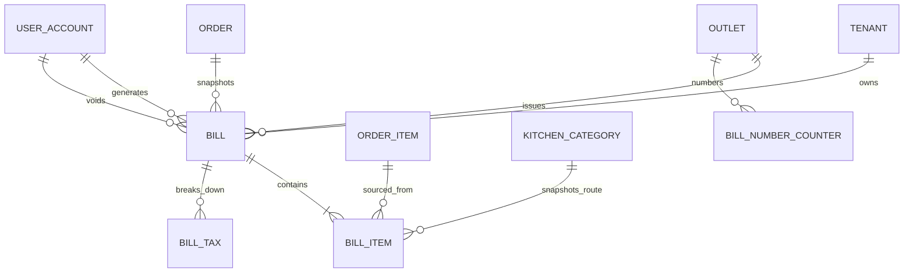

# Billing Schema

## ERD

## Models

`BillNumberCounter` provides an atomic outlet/business-date sequence.

`Bill` stores the order reference, bill and future invoice numbers, source,
currency, customer snapshots, subtotal, discounts, taxes, service charge,
round-off, grand total, loyalty/coupon placeholders, print metadata, source
bill IDs, and generation/void audit fields.

`BillItem` is a commercial snapshot sourced from an order item. It stores item
name, quantity, unit price, discounts, tax, line total, kitchen category, and
preparation time.

`BillTax` stores country-extensible named tax lines. Task 15 creates CGST, SGST,
or IGST lines without hard-coding those names into the database enum layer.

## Constraints

- All values are integer minor units; tax rates use `decimal(5,2)`.
- Bill, item, and tax monetary values must be nonnegative, except bill
  `roundOffAmount`, which may compensate upward or downward.
- The database verifies the complete grand-total formula.
- `VOID` requires reason, timestamp, and voiding user.
- Bill number and invoice number are unique per tenant/outlet.
- Tenant-aware composite foreign keys prevent cross-tenant bill composition.
- All four billing tables use forced PostgreSQL row-level security.

Migration: `20260612040000_add_billing_module`.
