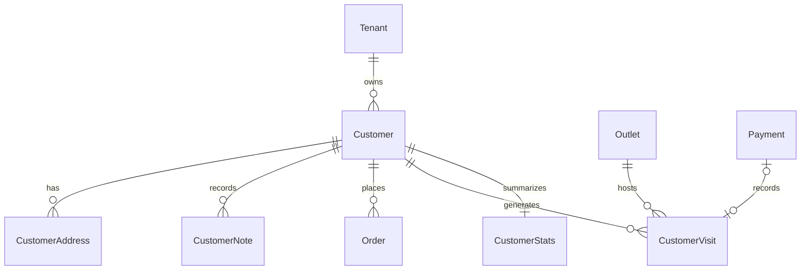

# Customer Schema

Customer identity is tenant-scoped. Phone and optional email are unique within
one tenant but may repeat across tenants. Phone values are normalized before
storage. `citext` provides case-insensitive email uniqueness.

Only one non-deleted default address may exist per customer. Notes and visits
are append-only. A successful payment can create at most one visit through
`(tenant_id, payment_id)` uniqueness.

Stats store integer minor-unit totals and are rebuilt from immutable visits.
Tenant-aware composite foreign keys connect orders, visits, bills, payments,
customers, and outlets. All customer tables use forced RLS.

Migration:
`backend/api/prisma/migrations/20260612230000_add_customer_management/migration.sql`.
