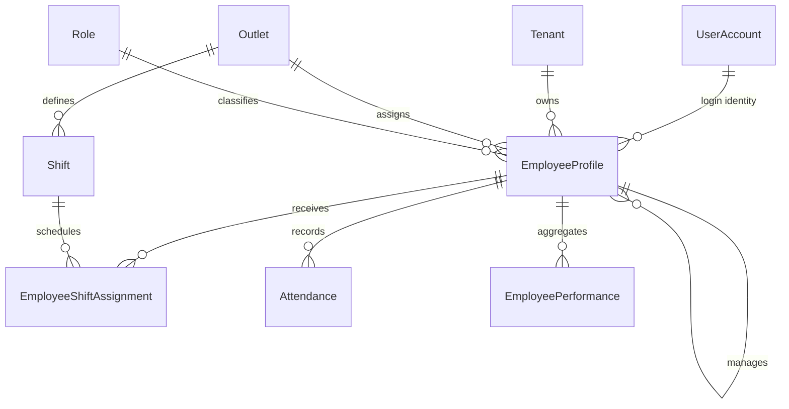

# Employee and Staff Schema

## ERD

`EmployeeProfile` is not an authentication identity. It extends an existing
global `UserAccount` inside one tenant and requires that user's active
membership, role assignment, and outlet assignment.

## Invariants

- Employee code and user profile are unique per tenant.
- Salary is stored in integer minor units and cannot be negative.
- Reporting managers must be employees in the same tenant and outlet.
- Shift assignments are effective dated and checked for overlap by the API.
- Attendance is unique per tenant, employee, and attendance date.
- Check-out cannot precede check-in; worked minutes cannot be negative.
- Performance is unique per tenant, employee, and business date.
- Customer ratings, when introduced, are constrained to zero through five.
- Employee removal is soft termination; workforce history remains immutable.

## Security and Performance

All five tenant-owned tables use forced PostgreSQL RLS. Composite indexes cover
employee directories, active shifts, effective assignments, business-date
attendance, and business-date performance leaderboards.

Migration: `20260613060000_add_employee_staff_management`.
