# Initial Database ERD

## Purpose

This document defines the initial PostgreSQL relational model for the ServeIQ
multi-tenant restaurant platform.

The tenant, outlet, global user, membership, role, permission, and outlet-scope
portion of this ERD was implemented in Task 6. See
[`tenancy-authorization-schema.md`](tenancy-authorization-schema.md) for the
executable schema contract and deliberate implementation details.

It is an implementation baseline, not a complete enterprise schema. The first
release focuses on:

- Tenant and outlet isolation
- Identity, membership, roles, and outlet scope
- Menu and pricing
- Orders, kitchen tickets, and payments
- Inventory recipes and stock movement
- Customers and basic loyalty
- Devices, offline synchronization, audit, and outbox events

Subscription billing, marketing automation, procurement, workforce, reservations,
advanced reporting, and franchise hierarchy are deferred but must preserve the
same tenant and ledger conventions.

## Modeling Conventions

### Identifiers

- Primary keys use UUIDv7 or another time-sortable UUID.
- Offline-created aggregates, including orders, use client-generated IDs.
- Human-readable numbers such as receipt and order numbers are separate fields.

### Tenant ownership

- Every tenant-owned table includes `tenant_id`.
- Tenant-owned unique constraints begin with `tenant_id`.
- Tenant-owned foreign keys should include `tenant_id` through composite keys
  where practical.
- PostgreSQL row-level security is enabled on tenant-owned tables.
- Tenant context is set by the API transaction, not trusted from request payloads.

### Time and versioning

- Instants use `timestamptz` and are stored in UTC.
- Tenants and outlets store IANA timezone identifiers.
- Mutable aggregates include an integer `version` for optimistic concurrency.
- Effective-dated rules use `effective_from` and nullable `effective_to`.

### Financial and quantity values

- Money uses integer minor units plus an ISO currency code.
- Inventory quantity uses `numeric(18,6)`.
- Tax rates and percentages use integer basis points or explicit numeric rates.
- Financial, stock, loyalty, and audit records are append-only.

### Deletion

- Master data may use `deleted_at` for soft deletion.
- Orders, payments, stock ledger, loyalty ledger, fiscal documents, and audit
  events are never cascade-deleted.
- Corrections use compensating records.

## Initial Entity Relationship Diagram

```mermaid
erDiagram
    TENANT {
        uuid id PK
        string slug UK
        string name
        string status
        string locale
        string timezone
        string currency_code
        timestamptz created_at
    }

    OUTLET {
        uuid id PK
        uuid tenant_id FK
        string code
        string name
        string timezone
        string status
        integer version
    }

    USER_ACCOUNT {
        uuid id PK
        string email
        string phone
        string display_name
        string status
        timestamptz created_at
    }

    TENANT_MEMBERSHIP {
        uuid id PK
        uuid tenant_id FK
        uuid user_id FK
        string status
        integer version
    }

    ROLE {
        uuid id PK
        uuid tenant_id FK
        string name
        string system_key
        boolean is_system
    }

    PERMISSION {
        uuid id PK
        string permission_key UK
        string module
        string description
    }

    MEMBERSHIP_ROLE {
        uuid tenant_id FK
        uuid membership_id FK
        uuid role_id FK
    }

    ROLE_PERMISSION {
        uuid tenant_id FK
        uuid role_id FK
        uuid permission_id FK
        jsonb constraints
    }

    MEMBERSHIP_OUTLET {
        uuid tenant_id FK
        uuid membership_id FK
        uuid outlet_id FK
    }

    MENU_CATEGORY {
        uuid id PK
        uuid tenant_id FK
        uuid parent_id FK
        string name
        integer sort_order
        boolean active
    }

    MENU_ITEM {
        uuid id PK
        uuid tenant_id FK
        uuid category_id FK
        string sku
        string name
        string item_type
        uuid tax_group_id FK
        boolean active
        integer version
    }

    ITEM_VARIANT {
        uuid id PK
        uuid tenant_id FK
        uuid menu_item_id FK
        string sku
        string name
        boolean active
    }

    PRICE_BOOK {
        uuid id PK
        uuid tenant_id FK
        uuid outlet_id FK
        string name
        string channel
        string order_type
        timestamptz effective_from
        timestamptz effective_to
    }

    ITEM_PRICE {
        uuid id PK
        uuid tenant_id FK
        uuid price_book_id FK
        uuid menu_item_id FK
        uuid item_variant_id FK
        bigint amount_minor
        string currency_code
    }

    TAX_GROUP {
        uuid id PK
        uuid tenant_id FK
        string name
        boolean prices_include_tax
    }

    TAX_RATE {
        uuid id PK
        uuid tenant_id FK
        uuid tax_group_id FK
        string name
        integer rate_basis_points
        timestamptz effective_from
        timestamptz effective_to
    }

    CUSTOMER {
        uuid id PK
        uuid tenant_id FK
        string name
        string email_encrypted
        string email_hash
        string phone_encrypted
        string phone_hash
        string status
        integer version
    }

    RESTAURANT_TABLE {
        uuid id PK
        uuid tenant_id FK
        uuid outlet_id FK
        string code
        integer capacity
        string status
        integer version
    }

    ORDER_HEADER {
        uuid id PK
        uuid tenant_id FK
        uuid outlet_id FK
        uuid customer_id FK
        uuid table_id FK
        uuid opened_by_membership_id FK
        string order_number
        string order_type
        string state
        string currency_code
        bigint subtotal_minor
        bigint tax_minor
        bigint service_charge_minor
        bigint discount_minor
        bigint total_minor
        integer version
        timestamptz opened_at
        timestamptz completed_at
    }

    ORDER_LINE {
        uuid id PK
        uuid tenant_id FK
        uuid order_id FK
        uuid menu_item_id FK
        uuid item_variant_id FK
        string item_name_snapshot
        string sku_snapshot
        integer quantity
        bigint unit_price_minor
        bigint subtotal_minor
        bigint tax_minor
        bigint discount_minor
        bigint total_minor
        string state
    }

    ORDER_STATE_EVENT {
        uuid id PK
        uuid tenant_id FK
        uuid order_id FK
        uuid actor_membership_id FK
        string from_state
        string to_state
        string reason
        timestamptz occurred_at
    }

    KITCHEN_STATION {
        uuid id PK
        uuid tenant_id FK
        uuid outlet_id FK
        string code
        string name
        boolean active
    }

    KITCHEN_TICKET {
        uuid id PK
        uuid tenant_id FK
        uuid outlet_id FK
        uuid order_id FK
        uuid station_id FK
        string state
        integer priority
        timestamptz created_at
        timestamptz ready_at
    }

    KITCHEN_TICKET_ITEM {
        uuid id PK
        uuid tenant_id FK
        uuid ticket_id FK
        uuid order_line_id FK
        string state
        timestamptz started_at
        timestamptz ready_at
    }

    PAYMENT {
        uuid id PK
        uuid tenant_id FK
        uuid outlet_id FK
        uuid order_id FK
        string method
        string state
        bigint amount_minor
        string currency_code
        string external_reference
        string idempotency_key
        timestamptz paid_at
    }

    REFUND {
        uuid id PK
        uuid tenant_id FK
        uuid payment_id FK
        uuid approved_by_membership_id FK
        bigint amount_minor
        string reason
        string state
        timestamptz created_at
    }

    FISCAL_DOCUMENT {
        uuid id PK
        uuid tenant_id FK
        uuid outlet_id FK
        uuid order_id FK
        string document_type
        string document_number
        jsonb document_snapshot
        timestamptz issued_at
    }

    INVENTORY_ITEM {
        uuid id PK
        uuid tenant_id FK
        string sku
        string name
        string base_unit
        boolean allow_negative
        integer version
    }

    RECIPE {
        uuid id PK
        uuid tenant_id FK
        uuid menu_item_id FK
        integer version_number
        timestamptz effective_from
        timestamptz effective_to
    }

    RECIPE_COMPONENT {
        uuid id PK
        uuid tenant_id FK
        uuid recipe_id FK
        uuid inventory_item_id FK
        decimal quantity
        string unit
    }

    STOCK_LOCATION {
        uuid id PK
        uuid tenant_id FK
        uuid outlet_id FK
        string code
        string name
        string location_type
    }

    STOCK_LEDGER {
        uuid id PK
        uuid tenant_id FK
        uuid outlet_id FK
        uuid location_id FK
        uuid inventory_item_id FK
        decimal quantity_delta
        bigint value_delta_minor
        string reason_type
        uuid reference_id
        string operation_id
        timestamptz occurred_at
    }

    STOCK_BALANCE {
        uuid tenant_id FK
        uuid location_id FK
        uuid inventory_item_id FK
        decimal on_hand
        decimal reserved
        bigint value_minor
        integer version
    }

    LOYALTY_PROGRAM {
        uuid id PK
        uuid tenant_id FK
        string name
        boolean active
        integer earn_basis_points
        integer redemption_value_minor
    }

    LOYALTY_ACCOUNT {
        uuid id PK
        uuid tenant_id FK
        uuid customer_id FK
        uuid program_id FK
        string tier
        integer version
    }

    LOYALTY_LEDGER {
        uuid id PK
        uuid tenant_id FK
        uuid account_id FK
        bigint points_delta
        string reason_type
        uuid reference_id
        timestamptz expires_at
        timestamptz occurred_at
    }

    TERMINAL {
        uuid id PK
        uuid tenant_id FK
        uuid outlet_id FK
        string code
        string status
        string credential_hash
        bigint last_sync_cursor
        timestamptz last_seen_at
    }

    SYNC_OPERATION {
        uuid id PK
        uuid tenant_id FK
        uuid terminal_id FK
        string operation_id
        string aggregate_type
        uuid aggregate_id
        integer base_version
        string operation_type
        jsonb payload
        string result
        timestamptz received_at
    }

    SYNC_CHANGE {
        bigint cursor PK
        uuid tenant_id FK
        string entity_type
        uuid entity_id
        string change_type
        jsonb payload
        timestamptz occurred_at
    }

    AUDIT_EVENT {
        bigint sequence PK
        uuid tenant_id FK
        uuid outlet_id FK
        uuid actor_user_id FK
        uuid actor_membership_id FK
        string action
        string resource_type
        uuid resource_id
        string reason
        string request_id
        string previous_hash
        string event_hash
        timestamptz occurred_at
    }

    OUTBOX_EVENT {
        uuid id PK
        uuid tenant_id FK
        string aggregate_type
        uuid aggregate_id
        string event_type
        jsonb payload
        string status
        integer attempt_count
        timestamptz available_at
        timestamptz occurred_at
    }

    TENANT ||--o{ OUTLET : owns
    USER_ACCOUNT ||--o{ TENANT_MEMBERSHIP : has
    TENANT ||--o{ TENANT_MEMBERSHIP : grants
    TENANT_MEMBERSHIP ||--o{ MEMBERSHIP_ROLE : assigned
    ROLE ||--o{ MEMBERSHIP_ROLE : includes
    ROLE ||--o{ ROLE_PERMISSION : grants
    PERMISSION ||--o{ ROLE_PERMISSION : contained_by
    TENANT_MEMBERSHIP ||--o{ MEMBERSHIP_OUTLET : scoped
    OUTLET ||--o{ MEMBERSHIP_OUTLET : permits

    TENANT ||--o{ MENU_CATEGORY : defines
    MENU_CATEGORY ||--o{ MENU_CATEGORY : parent_of
    MENU_CATEGORY ||--o{ MENU_ITEM : contains
    TAX_GROUP ||--o{ MENU_ITEM : taxes
    MENU_ITEM ||--o{ ITEM_VARIANT : has
    TENANT ||--o{ PRICE_BOOK : defines
    OUTLET ||--o{ PRICE_BOOK : uses
    PRICE_BOOK ||--o{ ITEM_PRICE : contains
    MENU_ITEM ||--o{ ITEM_PRICE : priced
    ITEM_VARIANT ||--o{ ITEM_PRICE : optionally_priced
    TAX_GROUP ||--o{ TAX_RATE : contains

    TENANT ||--o{ CUSTOMER : owns
    OUTLET ||--o{ RESTAURANT_TABLE : contains
    OUTLET ||--o{ ORDER_HEADER : receives
    CUSTOMER ||--o{ ORDER_HEADER : places
    RESTAURANT_TABLE ||--o{ ORDER_HEADER : serves
    TENANT_MEMBERSHIP ||--o{ ORDER_HEADER : opens
    ORDER_HEADER ||--|{ ORDER_LINE : contains
    MENU_ITEM ||--o{ ORDER_LINE : snapshots
    ITEM_VARIANT ||--o{ ORDER_LINE : optionally_snapshots
    ORDER_HEADER ||--o{ ORDER_STATE_EVENT : transitions

    OUTLET ||--o{ KITCHEN_STATION : contains
    ORDER_HEADER ||--o{ KITCHEN_TICKET : routes
    KITCHEN_STATION ||--o{ KITCHEN_TICKET : receives
    KITCHEN_TICKET ||--|{ KITCHEN_TICKET_ITEM : contains
    ORDER_LINE ||--o{ KITCHEN_TICKET_ITEM : tracks

    ORDER_HEADER ||--o{ PAYMENT : paid_by
    PAYMENT ||--o{ REFUND : refunded_by
    ORDER_HEADER ||--o{ FISCAL_DOCUMENT : documented_by

    MENU_ITEM ||--o{ RECIPE : produced_by
    RECIPE ||--|{ RECIPE_COMPONENT : contains
    INVENTORY_ITEM ||--o{ RECIPE_COMPONENT : consumed_as
    OUTLET ||--o{ STOCK_LOCATION : contains
    STOCK_LOCATION ||--o{ STOCK_LEDGER : records
    INVENTORY_ITEM ||--o{ STOCK_LEDGER : moved
    STOCK_LOCATION ||--o{ STOCK_BALANCE : projects
    INVENTORY_ITEM ||--o{ STOCK_BALANCE : balances

    TENANT ||--o{ LOYALTY_PROGRAM : defines
    CUSTOMER ||--o{ LOYALTY_ACCOUNT : owns
    LOYALTY_PROGRAM ||--o{ LOYALTY_ACCOUNT : enrolls
    LOYALTY_ACCOUNT ||--o{ LOYALTY_LEDGER : posts

    OUTLET ||--o{ TERMINAL : operates
    TERMINAL ||--o{ SYNC_OPERATION : submits
    TENANT ||--o{ SYNC_CHANGE : receives
    TENANT ||--o{ AUDIT_EVENT : records
    TENANT ||--o{ OUTBOX_EVENT : publishes
```



## Table Groups

### Platform and tenancy

| Table | Purpose |
|---|---|
| `tenants` | Restaurant business tenant and default locale settings |
| `outlets` | Tenant-owned operating locations |

Subscription tables are intentionally deferred from the initial transactional
ERD. They will be platform-owned but reference `tenants`.

### Identity and authorization

| Table | Purpose |
|---|---|
| `user_accounts` | Global login identity |
| `tenant_memberships` | User access to a tenant |
| `roles` | System or tenant-defined role |
| `permissions` | Platform permission catalog |
| `membership_roles` | Membership-to-role assignment |
| `role_permissions` | Role permission and contextual constraints |
| `membership_outlets` | Outlet scope for a membership |

A user can belong to multiple tenants. Roles are resolved within one tenant
membership and never globally trusted for tenant operations.

### Catalog and pricing

| Table | Purpose |
|---|---|
| `menu_categories` | Hierarchical menu organization |
| `menu_items` | Sellable menu products |
| `item_variants` | Size or other sellable variants |
| `price_books` | Outlet/channel/order-type pricing context |
| `item_prices` | Effective price for an item or variant |
| `tax_groups` | Tax behavior assigned to menu items |
| `tax_rates` | Effective-dated component rates |

Modifier groups, add-ons, combos, availability schedules, multilingual content,
and media files are planned additions.

### Orders and kitchen

| Table | Purpose |
|---|---|
| `restaurant_tables` | Outlet dining tables |
| `order_headers` | Order aggregate and totals |
| `order_lines` | Commercial item snapshots |
| `order_state_events` | Append-only state transition history |
| `kitchen_stations` | Outlet preparation stations |
| `kitchen_tickets` | Station-routed order ticket |
| `kitchen_ticket_items` | Item-level preparation state |

Completed orders retain item, price, and tax snapshots so later configuration
changes cannot rewrite history.

### Payments and fiscal records

| Table | Purpose |
|---|---|
| `payments` | Tender or payment-provider transaction |
| `refunds` | Full or partial compensating refund |
| `fiscal_documents` | Immutable receipt, invoice, or credit-note snapshot |

Payment provider events, settlements, chargebacks, cash drawers, and drawer
movements are planned additions.

### Inventory

| Table | Purpose |
|---|---|
| `inventory_items` | Ingredient or stock product |
| `recipes` | Effective menu-item recipe version |
| `recipe_components` | Ingredient consumption rule |
| `stock_locations` | Outlet storage location |
| `stock_ledger` | Append-only stock and value movement |
| `stock_balances` | Transactionally maintained balance projection |

Stock counts, transfers, waste, lots, expiry, vendors, purchase orders, and goods
receipts are planned additions.

### Customers and loyalty

| Table | Purpose |
|---|---|
| `customers` | Tenant-owned customer profile |
| `loyalty_programs` | Basic tenant loyalty configuration |
| `loyalty_accounts` | Customer enrollment and tier |
| `loyalty_ledger` | Append-only points movement |

Consent history, addresses, wallet, gift cards, referrals, customer segments, and
campaigns are planned additions.

### Offline, audit, and integration

| Table | Purpose |
|---|---|
| `terminals` | Registered outlet device |
| `sync_operations` | Idempotent operations submitted by devices |
| `sync_changes` | Ordered server-to-client change feed |
| `audit_events` | Immutable security and business audit trail |
| `outbox_events` | Transactional integration and realtime event queue |

## Required Keys and Constraints

### Tenant isolation

Representative constraints:

```sql
unique (tenant_id, code)
unique (tenant_id, id)
foreign key (tenant_id, outlet_id)
  references outlets (tenant_id, id)
```

Tenant tables should expose a composite unique key on `(tenant_id, id)` when a
child table uses tenant-aware composite foreign keys.

### Idempotency

```sql
unique (tenant_id, terminal_id, operation_id)
unique (tenant_id, outlet_id, idempotency_key)
```

The second constraint may include endpoint or operation scope if one client key
can legitimately be reused across different commands.

### Business uniqueness

```sql
unique (tenant_id, outlet_id, order_number)
unique (tenant_id, outlet_id, document_type, document_number)
unique (tenant_id, sku)
unique (tenant_id, outlet_id, code)
```

Historical uniqueness remains enforced even when master records are soft-deleted.

### Financial integrity

- `amount_minor >= 0` for payments and refunds.
- Total refunds cannot exceed the captured refundable amount.
- Completed-order payment balance must equal the payable total within configured
  rounding rules.
- Fiscal document numbers are server-issued and unique per configured sequence.
- Payment, refund, and fiscal rows cannot be updated to rewrite settled history.

### Stock integrity

- Every stock mutation inserts one `stock_ledger` row.
- `stock_balances` is updated in the same database transaction.
- Duplicate recipe consumption is prevented by an operation/reference unique key.
- Negative stock is allowed only when the inventory-item/outlet policy permits it.

### Loyalty integrity

- Point balance is derived from or reconciled against `loyalty_ledger`.
- Redemption cannot exceed available non-expired points.
- Order refund reversals reference the original earning ledger records.

## Row-Level Security Baseline

Every tenant table uses a policy equivalent to:

```sql
alter table orders enable row level security;

create policy tenant_isolation_orders on orders
using (
  tenant_id = current_setting('app.tenant_id', true)::uuid
)
with check (
  tenant_id = current_setting('app.tenant_id', true)::uuid
);
```

The application opens a transaction and sets:

```sql
set local app.tenant_id = '<trusted-tenant-id>';
set local app.user_id = '<authenticated-user-id>';
set local app.membership_id = '<tenant-membership-id>';
```

Migration, backup, and controlled platform-support roles use separate database
credentials and policies.

## Index Baseline

Initial indexes should include:

```text
outlets (tenant_id, status)
tenant_memberships (tenant_id, user_id, status)
menu_items (tenant_id, active, category_id)
item_prices (tenant_id, price_book_id, menu_item_id, item_variant_id)
customers (tenant_id, phone_hash)
customers (tenant_id, email_hash)
order_headers (tenant_id, outlet_id, opened_at desc)
order_headers (tenant_id, outlet_id, state)
order_lines (tenant_id, order_id)
kitchen_tickets (tenant_id, outlet_id, station_id, state, created_at)
payments (tenant_id, outlet_id, paid_at desc)
stock_ledger (tenant_id, location_id, inventory_item_id, occurred_at)
loyalty_ledger (tenant_id, account_id, occurred_at)
sync_changes (tenant_id, cursor)
audit_events (tenant_id, occurred_at desc)
outbox_events (status, available_at)
```

Index selection must be verified with actual query plans and production volume.

## Deferred Entities

The following entities are expected after the initial transactional foundation:

- Subscription plans, entitlements, usage counters, invoices, and coupons
- Legal entities and franchise hierarchy
- Modifier groups, combos, availability rules, and item media
- Reservations, waitlist, seating sessions, and table groups
- Cash drawers, settlements, provider events, and chargebacks
- Stock counts, waste, transfers, lots, expiry, and procurement
- Customer consent, wallet, gift cards, referrals, and campaigns
- Employees, shifts, attendance, and payroll exports
- Files, notifications, API keys, webhooks, and support cases
- Reporting projections and scheduled exports

## Migration Sequence

Recommended migration order:

1. PostgreSQL extensions, database roles, and helper functions
2. Tenants and outlets
3. Users, memberships, roles, permissions, and outlet scope
4. Tax, menu, variants, price books, and prices
5. Customers and restaurant tables
6. Orders, lines, and order state events
7. Kitchen stations, tickets, and ticket items
8. Payments, refunds, and fiscal documents
9. Inventory items, recipes, locations, stock ledger, and balances
10. Loyalty programs, accounts, and ledger
11. Terminals, sync operations, and sync change feed
12. Audit and transactional outbox
13. RLS policies, indexes, integrity triggers, and initial permission seed data

Each migration must be backward compatible with the currently deployed API
version and include a tested rollback or forward-repair strategy.

## Related Documentation

- [System overview](../architecture/system-overview.md)
- [Enterprise system design](../specifications/enterprise-system-design.md)
- [Database documentation](README.md)
