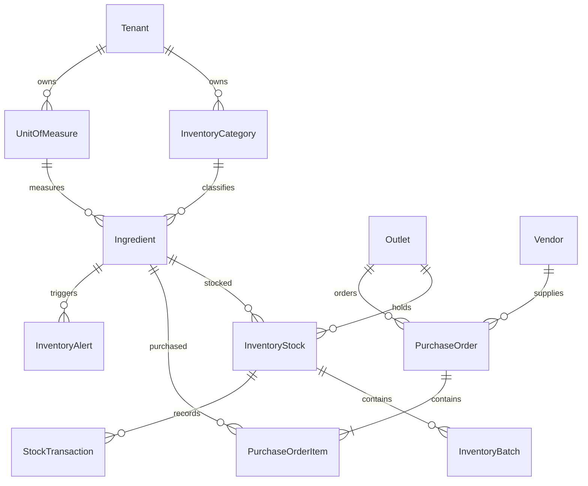

# Inventory Schema

## Ownership

Categories, units, ingredients, and vendors are tenant master data. Stocks,
batches, transactions, purchase orders, PO items, counters, and alerts include
tenant and outlet ownership. Composite foreign keys prevent cross-tenant
references.

All inventory tables use forced PostgreSQL row-level security through
`app_tenant_access_allowed(tenant_id)`.

## Quantity And Money

- Quantities: `DECIMAL(18,3)`
- Conversion factors: `DECIMAL(18,6)`
- Costs and PO totals: integer minor units
- One stock row: unique tenant, outlet, and ingredient
- Stock balances cannot be negative through supported application operations or
  database checks
- Stock transactions are append-only and use signed quantities

## Audit

Ingredients, vendors, and purchase orders retain created/updated actors.
Transactions retain the performing user. Purchase orders retain the receiving
user and timestamp. Explicit alert resolution retains actor and timestamp.

## Expiry

`InventoryBatch` stores batch number, quantity, manufacturing date, and expiry
date. Batch numbers are unique per tenant/outlet/ingredient. Date constraints
prevent expiry before manufacturing.

## Migration

`20260612170000_add_inventory_management`
