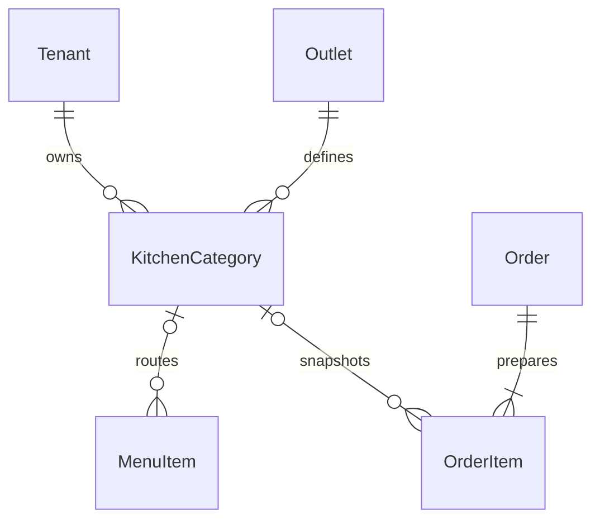

# Kitchen Display System Schema

## Schema Changes

`KitchenCategory` stores outlet station name, display order, active state,
version, timestamps, and soft deletion.

`MenuItem.kitchenCategoryId` is the default routing configuration.

`OrderItem` snapshots:

- `kitchenCategoryId`
- `firedAt`
- `startedAt`
- `readyAt`
- `servedAt`
- `estimatedPrepMinutes`
- `actualPrepMinutes`

`Order` adds `priority` and `estimatedCompletionTime`.

## Constraints

1. Station names are unique per tenant and outlet.
2. Station and item relations are tenant-aware.
3. Estimated preparation minutes are positive.
4. Actual preparation minutes are null or nonnegative.
5. Ready timestamps require a start; served timestamps require ready.
6. Station records use forced PostgreSQL row-level security.
7. Priority and station/status indexes support queue ordering and filtering.

Migration:
`backend/api/prisma/migrations/20260612010000_add_kitchen_display_system/migration.sql`.

The current menu field represents one default station route. Order creation
validates the station outlet before snapshotting it, so an invalid cross-outlet
default remains unrouted rather than leaking another outlet's station.
