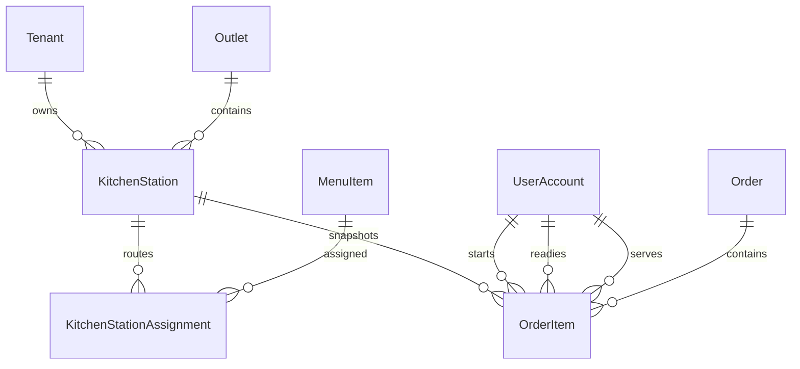

# Kitchen Schema

## Entity Relationship

## Kitchen Station

`KitchenStation` is tenant- and outlet-owned master data with name, code,
display order, active state, optimistic version, timestamps, and soft deletion.
Tenant-aware unique and foreign-key constraints prevent cross-tenant or
cross-outlet references.

`KitchenStationAssignment` maps menu items to one or more stations. Assignments
carry tenant and outlet scope so the database can enforce ownership and forced
RLS.

At order creation, the first active assignment by station display order is
copied to `OrderItem.kitchenStationId`. This deterministic primary-station
snapshot keeps historical routing stable if assignments later change. The
many-to-many assignment model preserves support for future fan-out workflows.

## Order Item Kitchen Fields

Order items store:

- `kitchenStationId`
- `firedAt`
- `startedAt`
- `readyAt`
- `servedAt`
- `estimatedPrepTimeMinutes`
- `actualPrepTimeMinutes`
- `startedByUserId`
- `readyByUserId`
- `servedByUserId`

The actor relations provide transition auditability. Preparation duration is
derived when an item becomes ready and retained for operational analytics.

## Priority And Indexes

`OrderPriority` supports `NORMAL`, `HIGH`, `VIP`, and `URGENT`.

Queue indexes cover tenant, station, status, and soft-deletion filters. Station
and assignment tables also index tenant/outlet active lookups and routing joins.

## Security

Both new station tables use forced PostgreSQL row-level security. Socket and
HTTP database work establishes transaction-local user, tenant, and
platform-admin settings before querying tenant-owned tables.

Migration:

`20260612130000_complete_kitchen_display_system`
