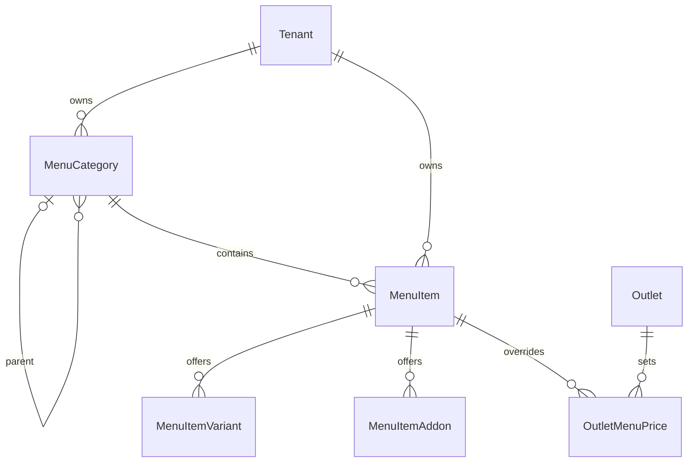

# Menu Schema

`MenuCategory`, `MenuItem`, `MenuItemVariant`, `MenuItemAddon`, and
`OutletMenuPrice` carry `tenant_id`. Composite foreign keys prevent cross-tenant
category, item, outlet, variant, add-on, and price references.

All menu tables use forced PostgreSQL row-level security. Base, cost,
adjustment, add-on, and outlet prices use integer minor units. Tax percentage is
`numeric(5,2)`. A partial unique index permits only one active default variant
per item.

Deletion is soft and mutable records carry a version for future optimistic
concurrency.

Migration:
`backend/api/prisma/migrations/20260611180000_add_menu_management/migration.sql`.
