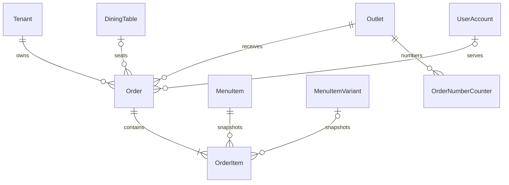

# Order Schema

## Models

- `OrderNumberCounter`: one row per tenant, outlet, and UTC business date.
- `Order`: lifecycle, type, optional table/customer/waiter references, currency,
  totals, cancellation/completion timestamps, and optimistic version.
- `OrderItem`: menu references plus immutable commercial snapshots and
  soft-removal state.

## Constraints

1. Order number is unique per tenant and outlet.
2. Dine-in orders require a table.
3. Delivery orders require `customerId` and cannot use a table.
4. Takeaway and QR orders cannot use a table.
5. Quantity, guest count, and counter values are positive.
6. Every monetary value is a nonnegative integer minor-unit amount.
7. Item tax percentage is between zero and 100.
8. Completed and cancelled states require their corresponding timestamps;
   cancellation also requires a reason.
9. Order, item, and counter tables use forced tenant RLS.
10. Tenant-aware order/table/menu foreign keys prevent cross-tenant references.

The migration is
`backend/api/prisma/migrations/20260611230000_add_order_management/migration.sql`.

## Deferred Customer Relation

The customer module does not yet exist. `Order.customerId` is therefore stored
as a tenant-scoped nullable UUID and delivery requirements are enforced by API
validation and a database check. Task introducing the customer aggregate must
add the tenant-aware foreign key without rewriting historical orders.
