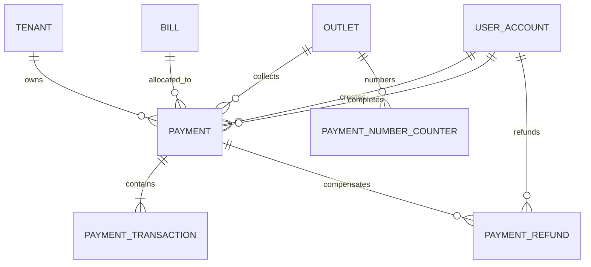

# Payment Schema

## ERD

## Models

`PaymentNumberCounter` atomically generates `PAY-YYYYMMDD-00001` per
outlet/business date.

`Payment` is the bill-level aggregate. It stores idempotency, optional single
method, source, collected/refunded totals, gateway/device/terminal/shift
metadata, business date, and create/complete audit users.

`PaymentTransaction` is an immutable tender/gateway attempt. A mixed split
payment has a null aggregate method and one transaction per tender.

`PaymentRefund` is an append-only compensating record with its own idempotency
key, number, reason, status, actor, and timestamp.

`Bill` now stores `paymentStatus`, `paidAmount`, `refundedAmount`, and
`outstandingAmount`.

## Constraints

- All payment, transaction, and refund amounts use integer minor units.
- Refund totals cannot exceed collected totals.
- Cash received and change must reconcile exactly.
- Card last four must contain four digits.
- Successful/refunded payments require completion actor and timestamp.
- Completed refunds require a refund timestamp.
- Tenant-aware foreign keys and forced RLS protect every payment table.

Migration: `20260612070000_add_payment_module`.
