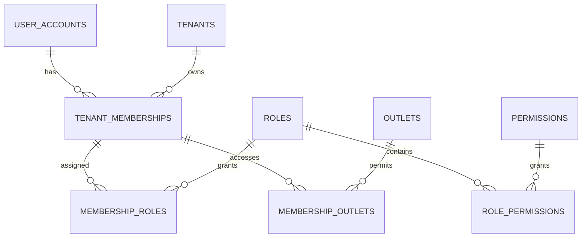

# RBAC Database Schema

Task 24 extends the existing normalized identity model. It does not add
duplicate `User`, `UserRole`, or `UserOutletAccess` tables.

## Task 24 Changes

Migration: `20260613140000_add_rbac_user_management`

- Adds `INACTIVE` to user and membership status enums.
- Adds `description` and `is_active` to tenant roles.
- Adds explicit `action` and `is_active` to global permissions.
- Backfills permission actions from existing `module.action` keys.
- Adds active-role and active-permission indexes.

`UserAccount` remains global so one identity can join multiple tenants.
Activation and suspension from tenant RBAC operate on `TenantMembership`, not
the global user, preventing one tenant from disabling access to another tenant.

## Tenant Isolation

`TenantMembership`, `Role`, `MembershipRole`, `RolePermission`, and
`MembershipOutlet` retain their existing tenant-aware composite keys and forced
PostgreSQL row-level security. API transactions establish trusted user, tenant,
and platform-admin context before tenant-owned queries.

System role templates remain global bootstrap definitions. Provisioned tenant
roles remain tenant-owned records. `SUPER_ADMIN` is a platform identity and is
not modeled as an ordinary tenant membership role.
