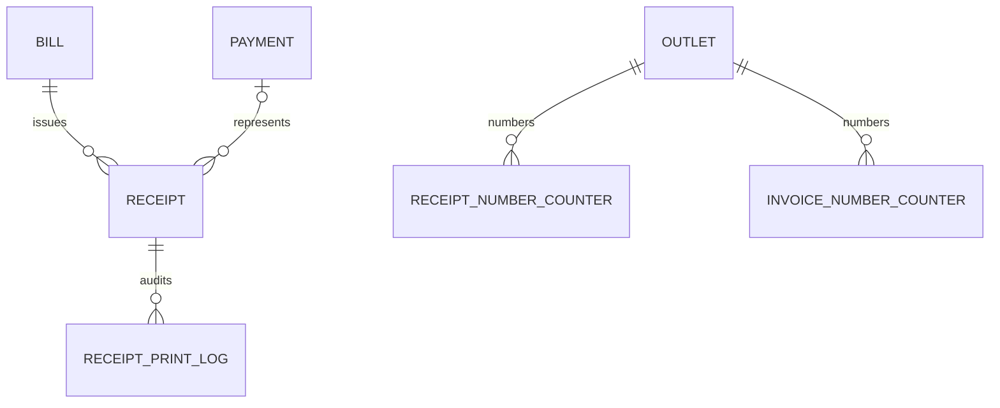

# Receipt Schema

`Receipt` references one tenant, outlet, bill, optional representative payment,
and generation user. Its JSONB printable payload contains immutable outlet,
customer, item, tax, payment, total, footer, and QR verification data.

`ReceiptNumberCounter` and `InvoiceNumberCounter` provide atomic outlet/day
sequences. `ReceiptPrintLog` is append-only and stores user, printer, printer
type, copies, reprint flag, and timestamp.

All four tables use forced PostgreSQL row-level security. Composite foreign keys
prevent cross-tenant bill, payment, outlet, and receipt references.
