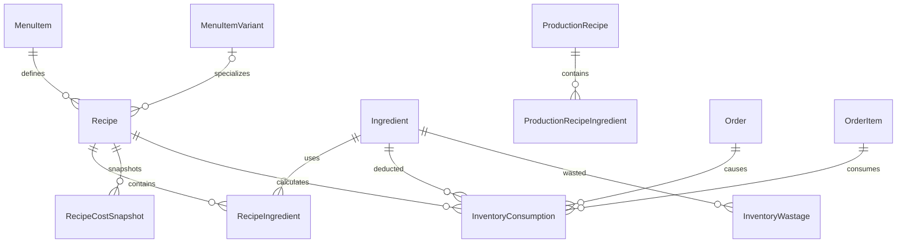

# Recipe And Consumption Schema

All new records carry tenant scope. Outlet movements also carry outlet scope.
Tenant-aware foreign keys and forced PostgreSQL RLS prevent cross-tenant
references and reads.

Important invariants:

- one active recipe per menu-item/variant target
- no duplicate ingredient in a recipe composition
- one consumption per tenant/order-item/ingredient
- positive recipe, yield, and movement quantities
- integer minor-unit cost snapshots
- immutable consumption, wastage, stock transaction, and cost history
- negative available stock is permitted by schema and controlled by outlet
  policy; reserved and damaged quantities remain non-negative

Migration:
`backend/api/prisma/migrations/20260612200000_add_recipe_consumption_engine/migration.sql`.
