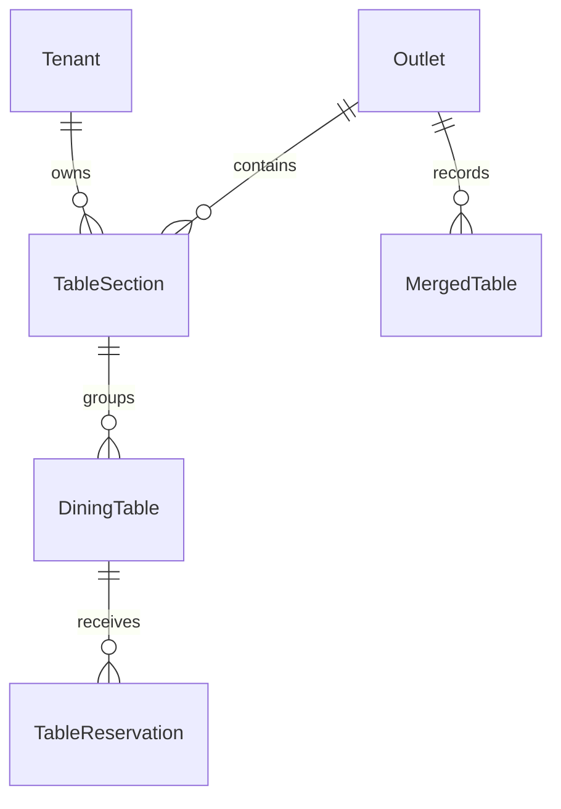

# Table Management Schema

Task 12 adds `TableSection`, `DiningTable`, `TableReservation`, and
`MergedTable` to the tenant and outlet boundary.

## Invariants

1. Section names are unique per active outlet.
2. Table numbers are unique per active outlet.
3. Composite foreign keys enforce matching tenant and outlet ownership.
4. Capacity and reservation guest counts must be positive.
5. Coordinates are non-negative decimal values.
6. Active reservations cannot duplicate the same table and timestamp.
7. Soft deletion and record versions preserve administrative history.
8. All four tables use forced PostgreSQL row-level security based on request
   tenant context, with platform-admin bypass through trusted request context.
9. `MergedTable.mergedTableIds` stores secondary table UUIDs; service-level
   transactions validate membership and update statuses atomically.

The migration is
`backend/api/prisma/migrations/20260611210000_add_table_management/migration.sql`.
It must be deployed before database-backed table endpoints are used.
