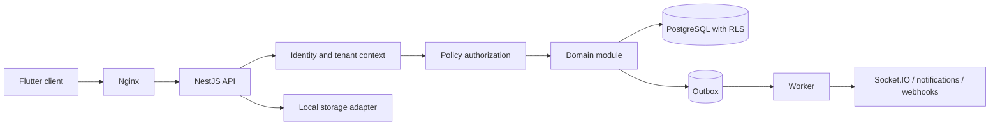
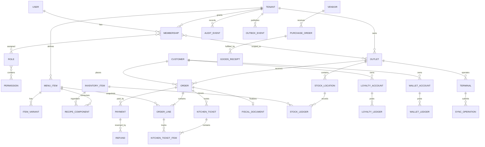

# Enterprise Multi-Tenant Restaurant POS SaaS - System Design

Status: Baseline architecture and product specification  
Target stack: Flutter, NestJS, PostgreSQL, Socket.IO, SQLite  
Initial deployment: Single Ubuntu LTS VPS without containers or managed cloud services

## 1. Executive Summary

The product is a multi-tenant restaurant operations platform for single outlets,
multi-outlet chains, franchises, cloud kitchens, cafes, bakeries, food courts,
and quick-service restaurants.

The recommended starting architecture is a modular monolith:

- One NestJS application split into strict business modules.
- One PostgreSQL cluster with a shared schema and mandatory `tenant_id`.
- PostgreSQL row-level security (RLS) as defense in depth.
- One Socket.IO gateway for POS, KDS, and operational events.
- Flutter clients for POS, mobile operations, and web administration.
- SQLite on POS devices for offline operation.
- Nginx, PM2, local file storage, and scheduled PostgreSQL backups.

This design is materially cheaper to operate than microservices on the initial
VPS, while domain boundaries, an event outbox, and storage abstractions preserve
a migration path to multiple servers and dedicated services.

### Architectural principles

1. Tenant context is established from a trusted authenticated identity, never
   from a client-supplied tenant ID alone.
2. Money, stock, loyalty points, wallet value, and audit history use append-only
   ledgers. Corrections are compensating entries, not destructive edits.
3. Every client mutation supports idempotency.
4. POS is local-first. The server is authoritative after deterministic conflict
   resolution.
5. Outlet restrictions are part of authorization, not UI filtering.
6. Orders preserve a commercial snapshot so later menu or tax changes do not
   rewrite historical sales.
7. Fiscal records are immutable after finalization except through controlled
   void, refund, or credit-note workflows.

## 2. Complete Feature List

### Platform and SaaS

- Tenant onboarding, activation, suspension, soft deletion, and data export.
- Subscription plans, trials, outlet-based pricing, add-ons, coupons, invoices,
  renewals, grace periods, upgrades, downgrades, and plan history.
- Usage metering for outlets, users, terminals, employees, menu items,
  customers, storage, reports, integrations, and premium features.
- Feature flags at platform, plan, tenant, and outlet levels.
- Super-admin analytics, support cases, platform health, and audited
  impersonation.
- Tenant branding, locale, currency, date format, receipt template, and domain.

### Restaurant operations

- Outlet, business-hour, service-area, tax, device, printer, and numbering setup.
- Dine-in, takeaway, delivery, QR, catering, drive-through, and aggregator orders.
- Draft, held, submitted, accepted, preparing, ready, served, completed,
  cancelled, voided, and refunded order states.
- Split/merge bills, split by item or guest, table transfer, waiter assignment,
  tips, discounts, coupons, service charges, rounding, and multiple payments.
- Floor plans, tables, sections, reservations, waitlist, table merge/split, and
  cleaning status.
- KDS stations, kitchen routing, preparation timers, priorities, recall, bump,
  item-level status, and service-level alerts.
- Receipt, kitchen ticket, tax invoice, credit note, digital receipt, and reprint.

### Menu and pricing

- Categories, subcategories, items, variants, modifier groups, add-ons, combos,
  recipes, allergens, dietary tags, images, and multilingual names.
- Price books by outlet, channel, order type, day, time, customer segment, and
  effective date.
- Availability schedules, daypart menus, stock-linked availability, and
  temporary eighty-six controls.
- Inclusive/exclusive taxes, tax groups, compound taxes, exemptions, and GST.

### Inventory and procurement

- Ingredients, units, conversions, batches, expiry dates, lot tracking, and
  storage locations.
- Vendors, purchase requisitions, purchase orders, receiving, returns, invoices,
  landed cost, and centralized purchasing.
- Recipe/BOM consumption, production/prep batches, waste, spoilage, counts,
  adjustments, par levels, low-stock alerts, and reorder suggestions.
- Inter-outlet transfer request, dispatch, in-transit, receipt, variance, and
  reconciliation.
- Stock valuation using a configurable method; weighted average is recommended
  for MVP, with FIFO as an enterprise option.

### Customers, loyalty, and marketing

- Customer profiles, consent, addresses, preferences, notes, order history,
  favorite items, and visit history.
- Points, tiers, cashback, gift cards, stored-value wallet, referrals, badges,
  milestones, rewards, expiry, and transaction history.
- Segments, campaigns, templates, suppression lists, scheduling, attribution,
  SMS, email, push, and personalized offers.
- Feedback, ratings, reviews, issue recovery, NPS/CSAT, churn scoring, CLV,
  retention, and loyalty ROI.

### Workforce

- Employee profiles, outlet assignment, custom roles, attendance, shifts,
  break tracking, tip allocation, performance, sales attribution, and payroll
  export readiness.
- Cash drawer assignment, blind close, supervisor override, and variance review.

### Finance, payments, and reporting

- Cash, card, UPI, online, wallet, gift card, house account, and split tender.
- Payment intents, settlements, refunds, partial refunds, chargebacks, tips,
  drawer movements, and payment reconciliation.
- Daily close, shift close, Z-report, tax/GST reports, profit and loss,
  cost-of-goods, discounts, voids, refunds, inventory valuation, and audit.
- Outlet and consolidated dashboards with saved filters and scheduled exports.

### Integration and administration

- Accounting, payment gateway, delivery aggregator, SMS, email, payroll, and
  fiscal-device adapter interfaces.
- API keys, signed webhooks, retry/dead-letter handling, imports, exports, and
  integration health.
- Notification center, operational alerts, support tickets, knowledge base,
  announcements, and maintenance notices.

## 3. Functional Requirements

### Tenant lifecycle

- FR-TEN-001: The platform shall create a tenant with an owner, default outlet,
  trial subscription, locale, currency, and immutable tenant identifier.
- FR-TEN-002: Every tenant-owned record shall carry `tenant_id`.
- FR-TEN-003: Suspended tenants may access billing and data export only; POS
  offline sales may remain local but cannot synchronize until reactivation.
- FR-TEN-004: Tenant deletion shall use a retention workflow: deactivate, export,
  legal hold check, scheduled purge, and purge certificate.

### Subscription enforcement

- FR-SUB-001: Entitlements shall be resolved from plan, add-ons, overrides, trial,
  and subscription state.
- FR-SUB-002: Hard limits shall block creation before exceeding a quota.
- FR-SUB-003: Downgrades shall not delete data. Excess resources become
  read-only or require remediation before downgrade completion.
- FR-SUB-004: Billing events and invoices shall be independently auditable.

### Identity and authorization

- FR-IAM-001: Authentication shall issue short-lived access tokens and rotating
  refresh tokens.
- FR-IAM-002: Authorization shall evaluate tenant, role, permission, outlet scope,
  resource ownership, and contextual policies.
- FR-IAM-003: Sensitive actions require recent authentication, an optional second
  factor, a reason, and an audit event.
- FR-IAM-004: Impersonation tokens shall be short-lived, read-only by default,
  visibly marked, and linked to the initiating administrator.

### Order-to-cash

- FR-ORD-001: A device shall create orders offline using a globally unique ID.
- FR-ORD-002: Prices, taxes, item names, recipes, discounts, and quantities used
  for a completed order shall be stored as snapshots.
- FR-ORD-003: Submitted kitchen items shall never be silently removed; removal
  creates a void item with reason and approver.
- FR-ORD-004: The payment total shall equal the payable amount before completion,
  subject to configured rounding tolerance.
- FR-ORD-005: Refunds shall reference original payments and cannot exceed the
  refundable balance.
- FR-ORD-006: Completed invoices shall use an outlet-specific, gap-aware fiscal
  sequence assigned by the server. Offline clients use temporary receipt IDs.

### Kitchen and tables

- FR-KDS-001: Submitted items shall route to stations based on category, item,
  modifier, course, and outlet configuration.
- FR-KDS-002: KDS status changes shall be real-time and persisted before broadcast.
- FR-TBL-001: A table shall have at most one active seating session unless the
  tenant enables shared-table mode.
- FR-RES-001: Reservation capacity shall account for table combinations, duration,
  setup time, and outlet operating hours.

### Inventory

- FR-INV-001: All quantity changes shall generate stock ledger entries.
- FR-INV-002: Completing an order shall post recipe consumption exactly once.
- FR-INV-003: Negative stock policy shall be configurable by outlet and item.
- FR-INV-004: Transfer receipt variances require a reason and optional approval.
- FR-INV-005: Unit conversions shall be versioned and decimal-safe.

### Loyalty and marketing

- FR-LOY-001: Points and wallet balances shall be derived from immutable ledgers.
- FR-LOY-002: Reward issuance and redemption shall be idempotent and reversible.
- FR-LOY-003: Marketing sends shall enforce consent, quiet hours, frequency caps,
  suppression, and jurisdictional rules.
- FR-LOY-004: Refunds shall reverse attributable points/cashback according to the
  earning rule active at purchase time.

### Reporting

- FR-REP-001: Operational dashboards may be near-real-time; statutory reports
  shall query reconciled source records.
- FR-REP-002: Reports shall use the tenant's timezone and preserve original
  transaction timezone and UTC timestamps.
- FR-REP-003: Exports shall be generated asynchronously for large date ranges.

### Offline synchronization

- FR-SYN-001: Every mutation shall include `operation_id`, `device_id`,
  `aggregate_id`, `base_version`, and local timestamp.
- FR-SYN-002: The server shall acknowledge accepted operations and return rejected
  conflicts with a machine-readable resolution policy.
- FR-SYN-003: Sync shall be resumable using an ordered server cursor.
- FR-SYN-004: Devices shall not directly merge payment, stock, wallet, or fiscal
  records; these domains use server-side ledger reconciliation.

## 4. Non-Functional Requirements

| Area | Initial target | Growth target |
|---|---:|---:|
| API availability | 99.5% monthly | 99.95% |
| POS local action latency | p95 under 150 ms | Same |
| Online API latency | p95 under 500 ms | p95 under 300 ms |
| KDS event propagation | p95 under 1 second | p95 under 500 ms |
| Tenant count | 1,000 | 10,000+ |
| Active outlets | 5,000 | 50,000+ |
| Concurrent sockets | 2,000 per node | Horizontal |
| Recovery point objective | 15 minutes | 5 minutes |
| Recovery time objective | 4 hours | 1 hour |
| Audit retention | 7 years configurable | Tiered archive |

Additional requirements:

- Monetary values use integer minor units plus currency; never binary floating point.
- Inventory quantities use PostgreSQL `numeric` with controlled precision.
- UTC is stored for instants; IANA timezones are stored for business interpretation.
- APIs are backward compatible within a major version.
- Accessibility target is WCAG 2.2 AA for administration and customer ordering.
- English is the default, with translation keys and RTL-ready layouts.
- Logs are structured, correlated, redact secrets/PII, and include tenant metadata.
- The system supports zero-downtime application deploys after moving beyond one VPS.
- Data imports are validated, previewed, idempotent, and reversible where feasible.

## 5. User Stories

### Super admin

- As a super admin, I can create plans and feature limits so pricing can evolve
  without a deployment.
- As a support agent, I can request an audited impersonation session so I can
  diagnose a tenant issue without learning the tenant's password.
- As a finance operator, I can review MRR, churn, overdue invoices, and failed
  renewals.

### Tenant owner and administrator

- As an owner, I can compare all outlets in one timezone-aware dashboard.
- As an administrator, I can create a role restricted to selected outlets.
- As an administrator, I can configure tax, receipt, payment, printer, and
  approval settings independently per outlet.
- As an owner, I can export all tenant data in a documented format.

### Manager

- As a manager, I can approve voids, refunds, discounts, stock variances, and
  cash discrepancies within configured thresholds.
- As a manager, I can close a business day and see unresolved exceptions.
- As a manager, I can eighty-six an item and immediately update POS, KDS, and QR.

### Cashier and waiter

- As a cashier, I can complete sales while offline and synchronize later.
- As a waiter, I can send courses to the kitchen and see item-level progress.
- As a cashier, I can split payment among cash, card, wallet, and gift card.
- As a waiter, I can transfer a table with supervisor approval when required.

### Kitchen staff

- As kitchen staff, I see only items routed to my station.
- As an expediter, I can prioritize, recall, and mark tickets ready.

### Inventory and purchasing

- As an inventory manager, I can count stock without seeing expected quantities
  in blind-count mode.
- As a purchaser, I can consolidate outlet demand into vendor purchase orders.
- As a receiving clerk, I can record partial deliveries, substitutions, lots,
  expiry dates, and invoice variances.

### Customers and marketing

- As a customer, I can identify myself by phone, email, or QR and earn rewards.
- As a marketer, I can build consent-compliant segments and measure campaign
  conversion.
- As a customer, I can view and redeem points, cashback, gift cards, and offers.

### Accountant

- As an accountant, I can reconcile payments, tax, cash drawers, refunds, and
  settlement fees.
- As an accountant, I can export journal-ready entries by outlet and legal entity.

## 6. Roles and Permission Matrix

Permissions use `module.resource.action` names such as `orders.order.refund`.
`Own` means records assigned to the user; `Outlet` means assigned outlets;
`Tenant` means all tenant outlets; `Platform` is cross-tenant.

| Capability | Super Admin | Tenant Admin | Manager | Cashier | Waiter | Kitchen | Inventory | Accountant |
|---|---|---|---|---|---|---|---|---|
| Tenant management | Platform | Own tenant | - | - | - | - | - | - |
| Subscription/billing | Platform | Tenant | View | - | - | - | - | View |
| Users and roles | Platform support | Tenant | Outlet limited | - | - | - | - | - |
| Menu configuration | Support scoped | Tenant | Outlet | View | View | View | View recipes | View |
| Create/edit orders | Support scoped | Tenant | Outlet | Outlet | Own/outlet | Status only | - | View |
| Discounts | Policy | Configure | Approve | Threshold | Threshold | - | - | Audit |
| Void/cancel | Policy | Configure | Approve | Request/threshold | Request | - | - | Audit |
| Refunds | Policy | Configure | Approve | Request/threshold | - | - | - | Reconcile |
| KDS operation | Support scoped | Configure | Outlet | View | View | Outlet | - | - |
| Table/reservations | Support scoped | Tenant | Outlet | Outlet | Outlet | View | - | - |
| Inventory ledger | Support scoped | Tenant | Outlet | Sale effects | - | Recipe view | Outlet | Audit |
| Purchasing | Support scoped | Tenant | Approve | - | - | - | Outlet | View |
| Customers | Support scoped | Tenant | Outlet | Outlet | Outlet | - | - | Masked |
| Loyalty/marketing | Support scoped | Tenant | Outlet | Redeem | Identify | - | - | Audit |
| Employee/shifts | Support scoped | Tenant | Outlet | Own | Own | Own | Own | Payroll export |
| Reports | Platform | Tenant | Outlet | Shift | Own | Kitchen | Inventory | Financial |
| Settings | Platform | Tenant | Outlet subset | Device subset | - | Station subset | Inventory subset | Finance subset |
| Audit logs | Platform | Tenant | Limited | Own | Own | Own | Own | Finance |
| Impersonation | Authorized only | - | - | - | - | - | - | - |

Custom roles are permission bundles plus constraints:

- `outlet_ids`
- maximum discount/refund/void amount
- permitted order types and payment methods
- allowed schedule
- PII field visibility
- approval requirements
- device or IP restrictions

## 7. Multi-Tenant Architecture

### Tenant resolution

1. User authenticates without submitting an authoritative tenant ID.
2. Server validates credentials and available memberships.
3. User selects a tenant if more than one membership exists.
4. Access token contains `sub`, `tenant_id`, membership ID, session ID, and token
   version. Permissions are resolved server-side or represented as a compact
   permission version.
5. NestJS request middleware establishes an immutable request context.
6. A transaction sets PostgreSQL session variables:
   `app.tenant_id`, `app.user_id`, and `app.impersonator_id`.
7. Repositories automatically apply tenant and soft-delete filters; RLS rejects
   cross-tenant access if a filter is missed.

Background jobs carry an explicit signed tenant context. Platform jobs must use
separate repository methods and privileged database roles.

### Isolation model

Initial model: shared database, shared schema.

- Every tenant-owned primary/unique index begins with `tenant_id` where practical.
- Foreign keys include tenant identity or are validated through composite keys.
- RLS policies use `current_setting('app.tenant_id', true)`.
- Database roles separate application, migration, backup, reporting, and support.
- Cache keys, file paths, socket rooms, metrics, and job payloads are tenant-prefixed.
- Tests attempt cross-tenant reads/writes for every repository.

Optional enterprise model:

- Large or regulated tenants can be moved to a dedicated database shard.
- A tenant directory maps tenant IDs to shard/data-source identifiers.
- Domain repositories hide the physical database selection.

### Request flow



## 8. Backend Architecture

### Modules

- `identity`: users, credentials, MFA, sessions, memberships.
- `tenancy`: tenants, legal entities, outlets, branding, settings.
- `authorization`: roles, permissions, outlet scopes, approvals.
- `subscriptions`: catalog, plans, add-ons, entitlements, usage, invoices.
- `catalog`: menu, modifiers, combos, price books, availability.
- `orders`: carts, orders, lines, charges, discounts, fiscal documents.
- `tables`: floors, tables, seating, reservations, waitlist.
- `kitchen`: stations, routing, tickets, preparation events.
- `payments`: tenders, gateway intents, refunds, settlements, drawers.
- `inventory`: items, recipes, stock ledger, counts, transfers, waste.
- `procurement`: vendors, POs, receiving, vendor invoices.
- `customers`: identity, consent, addresses, notes, segments.
- `loyalty`: points, tiers, wallet, gift cards, referrals, rewards.
- `marketing`: campaigns, templates, audiences, deliveries, attribution.
- `workforce`: employees, attendance, shifts, performance.
- `reporting`: projections, dashboards, exports, scheduled reports.
- `notifications`: inbox, email, SMS, push, templates.
- `files`: metadata, authorization, storage adapters, malware-scan hook.
- `integrations`: API keys, webhooks, accounting, delivery, payment adapters.
- `audit`: immutable security and business audit events.
- `sync`: device registration, operation ingestion, cursors, conflicts.
- `support`: support cases, impersonation, announcements.

### Layering

Each module follows:

```text
presentation -> application -> domain <- infrastructure
```

- Controllers/gateways validate transport DTOs.
- Application services own transactions, authorization, idempotency, and use cases.
- Domain objects enforce invariants and emit domain events.
- Repositories and external adapters implement domain ports.
- Cross-module communication uses public application APIs or domain events, not
  direct table access.

### Transactional outbox

State changes and integration events are committed in one PostgreSQL transaction.
A PM2 worker leases outbox rows using `FOR UPDATE SKIP LOCKED`, publishes them,
and records attempts. Consumers use an inbox table for idempotency.

Do not introduce Redis initially. When multiple API nodes are added, use Redis
for Socket.IO fan-out, distributed rate limits, cache, and short-lived locks.

## 9. Database Schema

Conventions:

- IDs are UUIDv7 or ULID generated client-side where offline creation is needed.
- Tenant tables include `tenant_id`, `created_at`, `updated_at`, `created_by`,
  `updated_by`, and `version`.
- Soft deletion is allowed for master data, not ledgers.
- `jsonb` is limited to snapshots, provider payloads, and extensible configuration.
- Searchable/reportable business fields remain typed columns.

### Platform and tenancy

| Table | Important columns |
|---|---|
| `tenants` | id, slug, name, status, locale, timezone, currency |
| `legal_entities` | tenant_id, legal_name, tax_ids, address |
| `outlets` | tenant_id, legal_entity_id, code, name, timezone, status |
| `tenant_settings` | tenant_id, namespace, key, typed_value, version |
| `feature_flags` | scope_type, scope_id, feature_key, enabled, rules |
| `plans` | code, name, billing_period, base_price, currency, active |
| `plan_entitlements` | plan_id, feature_key, limit_value, enforcement |
| `subscriptions` | tenant_id, plan_id, state, trial_end, period dates |
| `subscription_items` | subscription_id, type, quantity, unit_price |
| `subscription_events` | subscription_id, event_type, effective_at, snapshot |
| `billing_invoices` | tenant_id, number, totals, status, due_at |
| `usage_counters` | tenant_id, metric, period, quantity |

### Identity, access, and audit

| Table | Important columns |
|---|---|
| `users` | id, email, phone, display_name, platform_status |
| `user_credentials` | user_id, password_hash, changed_at, token_version |
| `tenant_memberships` | tenant_id, user_id, employee_id, status |
| `roles` | tenant_id nullable for system role, name, system_key |
| `permissions` | key, module, description, risk_level |
| `role_permissions` | tenant_id, role_id, permission_id, constraints |
| `membership_roles` | tenant_id, membership_id, role_id |
| `membership_outlets` | tenant_id, membership_id, outlet_id |
| `sessions` | user_id, tenant_id, refresh_hash, family_id, expires_at |
| `login_events` | user_id, tenant_id, result, ip, device, occurred_at |
| `approval_requests` | tenant_id, action, resource, requester, status |
| `impersonation_sessions` | admin_id, tenant_id, reason, start/end, scope |
| `audit_events` | sequence, tenant_id, actor, action, before/after hashes |

Audit rows are hash-chained per tenant/day and copied to write-once backup files.
Database privileges deny update/delete to the application audit role.

### Catalog and operations

| Table | Important columns |
|---|---|
| `menu_categories` | tenant_id, parent_id, name, sort_order |
| `menu_items` | tenant_id, sku, name, type, tax_group_id, active |
| `item_variants` | tenant_id, item_id, name, sku |
| `modifier_groups` | tenant_id, name, min/max selections |
| `modifiers` | tenant_id, group_id, name, price_delta |
| `item_modifier_groups` | tenant_id, item_id/variant_id, group_id |
| `combos` / `combo_components` | tenant_id, item_id, choice rules |
| `price_books` | tenant_id, outlet/channel/order_type, effective dates |
| `prices` | tenant_id, price_book_id, sellable_id, amount, currency |
| `availability_rules` | tenant_id, sellable_id, outlet_id, schedule, state |
| `tax_groups` / `tax_rates` | tenant_id, jurisdiction, rate, inclusive, dates |
| `floors` / `restaurant_tables` | tenant_id, outlet_id, geometry, capacity |
| `reservations` | tenant_id, outlet_id, customer_id, party size, status |
| `seating_sessions` | tenant_id, outlet_id, table group, opened/closed |

### Orders, payments, and kitchen

| Table | Important columns |
|---|---|
| `orders` | tenant_id, outlet_id, local_number, type, state, totals, version |
| `order_lines` | tenant_id, order_id, parent_line_id, item snapshot, qty, totals |
| `order_line_modifiers` | tenant_id, line_id, modifier snapshot, qty, totals |
| `order_charges` | tenant_id, order_id/line_id, type, rule snapshot, amount |
| `order_discounts` | tenant_id, order_id/line_id, source, reason, amount |
| `order_state_events` | tenant_id, order_id, from/to, actor, reason |
| `fiscal_documents` | tenant_id, outlet_id, order_id, number, type, snapshot |
| `payments` | tenant_id, order_id, method, amount, state, external_ref |
| `refunds` | tenant_id, payment_id, amount, reason, state |
| `payment_events` | tenant_id, payment_id, provider event, payload hash |
| `cash_drawers` | tenant_id, outlet_id, terminal_id, opened_by, state |
| `cash_movements` | tenant_id, drawer_id, type, amount, reason |
| `kitchen_tickets` | tenant_id, outlet_id, order_id, station_id, priority |
| `kitchen_ticket_items` | tenant_id, ticket_id, order_line_id, state, timers |

### Inventory and procurement

| Table | Important columns |
|---|---|
| `inventory_items` | tenant_id, sku, name, base_unit_id, tracking mode |
| `units` / `unit_conversions` | tenant_id, dimension, factor, effective dates |
| `recipes` / `recipe_components` | tenant_id, sellable_id, ingredient, quantity |
| `stock_locations` | tenant_id, outlet_id, name, type |
| `stock_ledger` | tenant_id, outlet_id, item_id, quantity, value, reason, ref |
| `stock_balances` | tenant_id, location_id, item_id, on_hand, reserved |
| `stock_lots` | tenant_id, item_id, lot, expiry, received cost |
| `stock_counts` / `stock_count_lines` | tenant_id, location, expected, counted |
| `waste_events` | tenant_id, location, item, quantity, reason |
| `stock_transfers` / `transfer_lines` | tenant_id, from/to, dispatched/received |
| `vendors` | tenant_id, identity, terms, tax details |
| `purchase_orders` / `purchase_order_lines` | tenant_id, vendor, status, totals |
| `goods_receipts` / `goods_receipt_lines` | tenant_id, PO, lots, variance |

### Customers and loyalty

| Table | Important columns |
|---|---|
| `customers` | tenant_id, phone/email hashes, name, birth date, status |
| `customer_addresses` | tenant_id, customer_id, address, geodata |
| `customer_consents` | tenant_id, customer_id, channel, purpose, evidence |
| `customer_notes` | tenant_id, customer_id, visibility, encrypted body |
| `loyalty_programs` / `loyalty_rules` | tenant_id, earn/redeem/expiry rules |
| `loyalty_accounts` | tenant_id, customer_id, program_id, tier |
| `loyalty_ledger` | tenant_id, account_id, points, reason, expiry, reference |
| `wallet_accounts` | tenant_id, customer_id, type, currency |
| `wallet_ledger` | tenant_id, account_id, amount, reason, reference |
| `gift_cards` | tenant_id, token hash, initial value, status, expiry |
| `referrals` | tenant_id, referrer, referred customer, state, rewards |
| `segments` / `segment_memberships` | tenant_id, definition, computed_at |
| `campaigns` / `campaign_deliveries` | tenant_id, audience, channel, outcome |
| `feedback` | tenant_id, order_id, customer_id, rating, category, response |

### Workforce, devices, sync, and integration

| Table | Important columns |
|---|---|
| `employees` | tenant_id, code, profile, employment status |
| `employee_outlets` | tenant_id, employee_id, outlet_id |
| `shifts` / `attendance_events` | tenant_id, outlet, employee, times, source |
| `terminals` | tenant_id, outlet_id, code, credentials, last_seen, status |
| `printers` / `print_routes` | tenant_id, outlet, capabilities, rules |
| `sync_operations` | tenant_id, device_id, operation_id, result, server_version |
| `sync_conflicts` | tenant_id, aggregate, client/server snapshot, resolution |
| `sync_change_log` | tenant_id, cursor, entity, entity_id, operation, payload |
| `files` | tenant_id, category, storage_key, mime, size, checksum |
| `outbox_events` / `inbox_messages` | tenant_id, event/message ID, status |
| `webhook_endpoints` / `webhook_deliveries` | tenant_id, secret, attempts |
| `api_keys` | tenant_id, key_hash, scopes, expiry, last_used |
| `notification_messages` | tenant_id, recipient, channel, template, status |

### Critical database constraints

- Unique `(tenant_id, outlet_id, code)` for outlet-scoped business codes.
- Unique `(tenant_id, device_id, operation_id)` for offline idempotency.
- Unique `(tenant_id, idempotency_key, endpoint_scope)` for API mutations.
- Check constraints prevent negative monetary values where not meaningful.
- Deferred constraint verifies completed order balance.
- Refund totals are protected by serializable transaction or row lock.
- Stock and wallet balance projections are updated in the same transaction as
  their ledger entry.
- No cascade delete from master data into financial or operational history.

## 10. ERD

The diagram shows the core transactional relationships; supporting configuration
and history tables are described in the schema catalog above.



## 11. API Specifications

Base path: `/api/v1`  
Format: JSON, UTF-8, ISO 8601 timestamps  
Authentication: `Authorization: Bearer <access-token>`  
Mutation idempotency: `Idempotency-Key` header  
Tracing: `X-Request-Id`; server returns `traceId` in errors  
Concurrency: `If-Match: "<version>"` for editable aggregates

### Response conventions

```json
{
  "data": {},
  "meta": {
    "requestId": "01J...",
    "nextCursor": null
  }
}
```

```json
{
  "error": {
    "code": "ORDER_VERSION_CONFLICT",
    "message": "The order changed on another device.",
    "details": {},
    "traceId": "01J..."
  }
}
```

Use cursor pagination for mutable/high-volume collections. Use `application/problem+json`
if strict RFC 9457 compatibility is preferred during implementation.

### Identity and tenant

| Method | Path | Purpose |
|---|---|---|
| POST | `/auth/login` | Authenticate |
| POST | `/auth/refresh` | Rotate refresh token |
| POST | `/auth/logout` | Revoke session |
| POST | `/auth/mfa/challenge` | Verify sensitive action |
| GET | `/me/memberships` | Available tenants |
| POST | `/auth/select-tenant` | Issue tenant-scoped token |
| GET/PATCH | `/tenant` | Tenant profile and branding |
| GET/POST | `/outlets` | List/create outlets |
| GET/PATCH | `/outlets/:id` | Outlet configuration |
| GET | `/entitlements` | Effective limits/features |

### Catalog, orders, and KDS

| Method | Path | Purpose |
|---|---|---|
| GET/POST | `/menu/items` | Search/create item |
| PATCH | `/menu/items/:id` | Update with version |
| POST | `/menu/items/:id/availability` | Set outlet availability |
| GET | `/catalog/snapshot?outletId=` | POS sync snapshot |
| POST | `/orders` | Create order |
| GET/PATCH | `/orders/:id` | Read/edit open order |
| POST | `/orders/:id/submit` | Submit new lines to kitchen |
| POST | `/orders/:id/hold` | Hold order |
| POST | `/orders/:id/void-lines` | Controlled item void |
| POST | `/orders/:id/split` | Split bill/order |
| POST | `/orders/merge` | Merge eligible orders |
| POST | `/orders/:id/complete` | Validate and finalize |
| GET | `/kitchen/tickets` | Station queue |
| POST | `/kitchen/tickets/:id/transition` | Change ticket/item state |

### Payments

| Method | Path | Purpose |
|---|---|---|
| POST | `/orders/:id/payments` | Record/initiate payment |
| POST | `/payments/:id/confirm` | Confirm external payment |
| POST | `/payments/:id/refunds` | Full/partial refund |
| POST | `/drawers/open` | Open cash drawer |
| POST | `/drawers/:id/movements` | Pay-in/pay-out |
| POST | `/drawers/:id/close` | Count and close |
| GET | `/settlements` | Reconcile providers |

### Inventory and procurement

| Method | Path | Purpose |
|---|---|---|
| GET/POST | `/inventory/items` | Manage ingredients/products |
| GET | `/inventory/balances` | Outlet/location balances |
| POST | `/inventory/adjustments` | Controlled adjustment |
| POST | `/inventory/counts` | Start stock count |
| POST | `/inventory/counts/:id/submit` | Post variance |
| POST | `/inventory/transfers` | Request transfer |
| POST | `/inventory/transfers/:id/dispatch` | Post source movement |
| POST | `/inventory/transfers/:id/receive` | Post destination/variance |
| GET/POST | `/vendors` | Vendor management |
| GET/POST | `/purchase-orders` | Purchasing |
| POST | `/purchase-orders/:id/receive` | Goods receipt |

### Customers and loyalty

| Method | Path | Purpose |
|---|---|---|
| GET/POST | `/customers` | Search/create customer |
| GET/PATCH | `/customers/:id` | Profile and consent-safe update |
| GET | `/customers/:id/timeline` | Orders, visits, rewards |
| GET | `/customers/:id/loyalty` | Balances and tier |
| POST | `/loyalty/quote` | Preview earn/redeem |
| POST | `/loyalty/redeem` | Redeem against order |
| POST | `/gift-cards/issue` | Issue stored value |
| POST | `/gift-cards/redeem` | Redeem stored value |
| GET/POST | `/segments` | Segment definitions |
| GET/POST | `/campaigns` | Campaign management |

### Reporting, files, and administration

| Method | Path | Purpose |
|---|---|---|
| GET | `/reports/sales-summary` | Aggregated sales |
| GET | `/reports/inventory-valuation` | Stock valuation |
| POST | `/report-exports` | Asynchronous export |
| GET | `/report-exports/:id` | Export status/download |
| POST | `/files/upload-intents` | Authorized upload metadata |
| GET | `/files/:id/content` | Authorized streamed download |
| GET | `/audit-events` | Filtered audit history |
| GET/POST | `/roles` | Custom RBAC |
| POST | `/approvals/:id/decide` | Approve/reject action |

### Offline sync

`POST /sync/push` accepts up to a configured batch size:

```json
{
  "deviceId": "01JDEVICE",
  "operations": [
    {
      "operationId": "01JOP",
      "aggregateType": "order",
      "aggregateId": "01JORDER",
      "baseVersion": 3,
      "localTimestamp": "2026-06-10T10:30:00+05:30",
      "type": "ADD_ORDER_LINE",
      "payload": {}
    }
  ]
}
```

`GET /sync/pull?cursor=12345&limit=500` returns ordered changes plus a new cursor.
Catalog snapshots are checksummed and downloaded separately to keep incremental
sync small.

### Socket.IO namespaces and events

- Namespace `/operations`: `order.updated`, `table.updated`, `availability.updated`.
- Namespace `/kitchen`: `ticket.created`, `ticket.updated`, `timer.alert`.
- Namespace `/admin`: `job.completed`, `alert.created`, `subscription.changed`.

Sockets authenticate during handshake and join only verified rooms such as
`tenant:{tenantId}:outlet:{outletId}:station:{stationId}`. Events include an ID,
aggregate version, occurred-at timestamp, and minimal payload; clients refetch
when a version gap is detected.

### Webhooks

Events include `order.completed`, `payment.completed`, `refund.completed`,
`customer.updated`, `stock.low`, and `subscription.changed`.

- HMAC-SHA256 signature with timestamp.
- At-least-once delivery.
- Exponential retry and dead-letter state.
- Endpoint-level event allowlist.
- Replay protection and delivery logs.

## 12. Flutter Application Architecture

Use one monorepo with reusable Dart packages and separate app entry points:

- POS app: tablet/desktop optimized, offline-first.
- Operations app: manager, waiter, inventory, and KDS modes.
- Admin web app: tenant and super-admin portals.
- Customer ordering app/web surface can be added later.

Recommended stack:

- State management: Riverpod.
- Routing: `go_router`.
- HTTP: Dio with auth, idempotency, retry, and tracing interceptors.
- Local database: Drift over SQLite.
- Serialization: `freezed` and `json_serializable`.
- Secure secrets: platform secure storage.
- Realtime: Socket.IO client with reconnect and version-gap recovery.

### Client layers

```text
presentation
  screens, widgets, controllers
application
  use cases, orchestration, sync coordinator
domain
  entities, value objects, repository contracts
data
  API sources, Drift sources, repository implementations
core
  auth, routing, errors, telemetry, feature flags, design system
```

### Offline model

- UI reads reactive data from SQLite, not directly from HTTP.
- User actions update local projections and append to `pending_operations` in one
  SQLite transaction.
- Sync worker pushes operations, applies acknowledgements, pulls server changes,
  and updates local projections.
- Failed operations are classified as retryable, authorization, validation, or
  manual conflict.
- Payments requiring an online processor cannot be falsely marked successful
  offline. They remain `pending_external_confirmation`.
- Cash and configured offline tender can complete locally with a temporary receipt.
- Device catalog includes effective prices, taxes, recipes needed for inventory,
  permissions, and entitlement expiry.
- A maximum offline duration is configurable to limit stale pricing and access.

### Conflict policy

| Domain | Policy |
|---|---|
| Open order lines | Merge commutative additions; version-check edits/removals |
| Table assignment | Server winner; losing device receives reassignment task |
| Menu/settings | Server authoritative |
| Stock | Accept ledger events, recalculate balance, flag negative/variance |
| Cash payment | Append if unique operation/reference |
| External payment | Provider/server authoritative |
| Loyalty/wallet | Server ledger authoritative; reserve or defer redemption |
| Customer profile | Field-level last-write with consent history preserved |

## 13. Folder Structures

### Repository

```text
restaurant-pos/
  api/
    src/
    test/
    migrations/
  apps/
    pos/
    operations/
    admin/
  packages/
    design_system/
    domain_models/
    api_client/
    offline_sync/
  docs/
  deploy/
    nginx/
    pm2/
    scripts/
  storage/
    .gitkeep
```

The existing `mobile-app/restaurantpos` prototype can be migrated into `apps/pos`
incrementally. Firebase should not remain the system of record under this design.

### NestJS module

```text
src/modules/orders/
  presentation/
    orders.controller.ts
    orders.gateway.ts
    dto/
  application/
    commands/
    queries/
    services/
  domain/
    aggregates/
    entities/
    value-objects/
    events/
    ports/
  infrastructure/
    persistence/
    integrations/
  orders.module.ts
```

### Flutter feature

```text
lib/features/orders/
  presentation/
    screens/
    widgets/
    controllers/
  application/
    use_cases/
  domain/
    entities/
    repositories/
  data/
    api/
    local/
    repositories/
```

## 14. Security Architecture

### Authentication

- Argon2id password hashing with calibrated memory/time cost.
- Access tokens expire in 5-15 minutes.
- Refresh tokens are random, rotated, hashed at rest, and grouped into token
  families; reuse revokes the family.
- MFA supports TOTP initially and WebAuthn later.
- Device credentials are separate from human credentials.
- Password reset and invitation tokens are single-use and hashed.
- Rate limits apply by IP, identity, tenant, endpoint, and device.

### Authorization

- Deny by default.
- NestJS guards enforce permission and outlet policies.
- Repository/RLS layer enforces tenant isolation independently.
- High-risk actions use approval workflows and amount thresholds.
- Support access is time-limited, reason-bound, and user-visible.
- Impersonation cannot change billing, credentials, security settings, or audit
  history unless a separately approved break-glass policy permits it.

### Data protection

- TLS 1.2+ via Nginx and Let's Encrypt.
- PostgreSQL and backup volumes use OS/disk encryption where available.
- Application-level envelope encryption protects secrets, customer notes,
  provider tokens, and sensitive identifiers.
- Searchable email/phone values use normalized keyed hashes plus separately
  encrypted display values.
- Card PAN/CVV is never stored; use payment-provider tokens.
- Logs and analytics avoid raw PII.
- Per-purpose retention and erasure workflows preserve legally required invoices.

### Application security

- DTO validation, output serialization, parameterized SQL, CSRF protection for
  cookie-based web flows, restrictive CORS, CSP, and secure headers.
- File allowlist, size limits, content sniffing prevention, randomized storage
  keys, checksum verification, and malware scanning hook.
- Dependency and secret scanning in CI.
- Signed releases and database migration review.
- OWASP ASVS Level 2 baseline; threat modeling for payments, offline sync,
  impersonation, and loyalty fraud.

### Audit integrity

Audit fields include actor, impersonator, tenant, outlet, action, resource,
reason, before/after hashes, request ID, IP, device, and timestamp.

- Append-only table permissions.
- Hash chain to detect tampering.
- Daily signed manifest copied off-host.
- Clock synchronization and UTC timestamps.
- Audit access itself is audited.

## 15. File Storage Architecture

Use a `FileStorage` port:

```text
put(stream, metadata) -> storageKey
get(storageKey) -> stream
delete(storageKey)
exists(storageKey)
signedOrAuthorizedDownload(fileId)
```

Initial local layout:

```text
/data/uploads/{tenant_id}/restaurants/{file_id}
/data/uploads/{tenant_id}/menu-items/{file_id}
/data/uploads/{tenant_id}/receipts/{yyyy}/{mm}/{file_id}
/data/uploads/{tenant_id}/reports/{yyyy}/{mm}/{file_id}
/data/uploads/{tenant_id}/customers/{file_id}
```

Original filenames are metadata only. Storage keys are generated and cannot
contain user-controlled path segments. Files are downloaded through an authorized
controller or temporary Nginx internal redirect. A future S3-compatible adapter
can replace local storage without changing domain modules.

## 16. Screen-by-Screen Specifications

### Shared and authentication

| Screen | Key content/actions |
|---|---|
| Login | Email/phone, password, tenant selection, MFA, device trust |
| Forgot/reset password | Identity verification, token validation, revoke sessions |
| Tenant switcher | Memberships, role, last used, subscription warning |
| Notification center | Operational, approval, billing, and system alerts |
| Profile/security | Sessions, MFA, password, language, activity |
| Offline/sync center | Connection, queue count, conflicts, last sync, retry |

### Super-admin portal

| Screen | Key content/actions |
|---|---|
| Platform dashboard | Tenants, MRR/ARR, churn, trials, errors, jobs, storage |
| Tenant directory | Search, status, plan, usage, health, suspend/activate |
| Tenant detail | Profile, subscription, usage, invoices, support, audit |
| Plans and add-ons | Entitlements, prices, versions, grandfathering |
| Billing operations | Invoices, payments, dunning, coupons, credits |
| Feature flags | Rules, staged rollout, tenant overrides, history |
| Support cases | SLA, assignments, tenant timeline, secure attachments |
| Impersonation request | Reason, scope, duration, approval, session banner |
| Platform health | API, DB, sockets, jobs, backups, disk, certificates |
| Platform audit | Security events, exports, immutable verification |

### Tenant admin and manager

| Screen | Key content/actions |
|---|---|
| Executive dashboard | Consolidated sales, COGS, labor, trends, exceptions |
| Outlet dashboard | Sales, orders, ticket times, stock, staff, alerts |
| Outlet setup | Hours, taxes, order types, printers, numbering, service areas |
| Menu builder | Hierarchy, item details, variants, modifiers, combos, recipes |
| Price books | Outlet/channel prices, effective dates, bulk updates |
| Availability | Schedule and immediate eighty-six controls |
| Users/roles | Invitations, custom roles, outlet scope, thresholds |
| Devices/printers | Pairing, health, last sync, routes, test print |
| Approval inbox | Voids, refunds, discounts, transfers, stock/cash variances |
| Business-day close | Exceptions, drawer status, settlement, final reports |

### POS and service

| Screen | Key content/actions |
|---|---|
| POS home | Order type, search, favorites, categories, customer, sync state |
| Cart/order | Lines, modifiers, notes, guests, courses, discounts, totals |
| Table map | Floor plan, statuses, timers, waiter, merge/transfer |
| Customer lookup | Search/create, consent, loyalty/wallet, history |
| Hold/resume | Held orders, owner, elapsed time, outlet/device |
| Payment | Split tender, tips, change, external status, balance |
| Receipt | Print/email/SMS, temporary or fiscal number, reprint reason |
| Refund/void | Eligible lines/payments, reason, approval, reversal result |
| Shift/drawer | Open, pay-in/out, blind count, variance, close |

### KDS

| Screen | Key content/actions |
|---|---|
| Station board | Queues by status, elapsed time, modifiers, course, priority |
| Ticket detail | Item status, notes, allergy warning, recall/bump |
| Expediter | Cross-station readiness, order completeness, serve status |
| KDS settings | Station routing, colors, timers, sounds, display density |

### Inventory and purchasing

| Screen | Key content/actions |
|---|---|
| Inventory dashboard | Value, low stock, expiry, variances, waste |
| Item detail | Units, lots, suppliers, movement ledger, par levels |
| Stock count | Blind/scanned count, save, review, submit |
| Waste | Item, quantity, reason, photo, approver |
| Transfers | Request, pick, dispatch, receive, variance |
| Vendors | Contacts, terms, catalog, performance |
| Purchase orders | Suggested quantities, approvals, send, status |
| Goods receipt | Partial receipt, lot/expiry, invoice and variance |

### CRM, loyalty, and marketing

| Screen | Key content/actions |
|---|---|
| Customer list/detail | Profile, consent, visits, CLV, notes, rewards |
| Loyalty program | Earn/redeem, tiers, expiry, simulations |
| Wallet/gift cards | Issue, adjust with approval, redeem, liability |
| Segments | Rule builder, preview, size, refresh schedule |
| Campaigns | Audience, template, schedule, budget, frequency cap |
| Feedback | Scores, comments, recovery tasks, response |

### Reports and finance

| Screen | Key content/actions |
|---|---|
| Sales reports | Period/outlet/channel/item/tax/payment drilldowns |
| Inventory reports | Consumption, variance, valuation, waste, transfers |
| Customer reports | Retention, cohorts, CLV, campaign/loyalty ROI |
| Employee reports | Sales, attendance, ticket time, discounts/voids |
| Tax/GST | Tax liability, invoice sequence, returns export |
| P&L | Revenue, COGS, gross margin, operating inputs |
| Reconciliation | Drawer, gateway settlement, refunds, chargebacks |
| Report scheduler | Format, recipients, frequency, access-controlled exports |

## 17. Deployment and Operations

### Initial VPS topology

```text
Internet
  -> Nginx :443
      -> NestJS API instances under PM2
      -> Socket.IO
      -> Flutter Web static assets
  -> PostgreSQL on localhost/private interface
  -> /data/uploads local filesystem
  -> backup scripts to encrypted off-host destination
```

PM2 processes:

- `api`: HTTP and Socket.IO.
- `worker`: outbox, reports, notifications, housekeeping.
- `scheduler`: singleton scheduled jobs guarded by PostgreSQL advisory locks.

### Operational requirements

- PostgreSQL accepts no public internet connections.
- UFW permits SSH from controlled sources and HTTP/HTTPS.
- SSH key authentication; root login and password authentication disabled.
- Separate Unix users and least-privilege filesystem permissions.
- `systemd` starts PM2 and monitors PostgreSQL/Nginx.
- Log rotation, disk alerts, certificate renewal monitoring, and time sync.
- Migrations run as a controlled pre-deploy step and remain backward compatible.
- Health endpoints: liveness, readiness, database, storage, queue lag, and disk.

## 18. Backup and Disaster Recovery

### Backup policy

- PostgreSQL: weekly full base backup plus continuous WAL archive for point-in-time
  recovery. Daily logical dump adds portability.
- Files: daily incremental and weekly full backup.
- Configuration: encrypted backup of Nginx, PM2, environment references, and
  infrastructure scripts.
- Encryption keys and secrets: separately escrowed, access-controlled backup.
- At least one backup is off-host and in a different failure domain.
- Retention example: 7 daily, 5 weekly, 12 monthly, 7 yearly where compliance
  requires it.

### Recovery procedure

1. Declare incident and freeze writes if partial corruption is suspected.
2. Provision a clean Ubuntu LTS host from documented scripts.
3. Restore PostgreSQL base backup and replay WAL to the selected point.
4. Restore files and verify checksums against file metadata.
5. Restore application version compatible with the schema.
6. Run tenant counts, ledger balance checks, invoice sequence checks, and sampled
   receipt/file verification.
7. Rotate credentials, reopen traffic, and monitor synchronization backlog.
8. Publish incident record and corrective actions.

Restore tests are performed quarterly. A backup is not considered valid until a
restore has succeeded and application-level integrity checks pass.

## 19. Scaling Strategy

### Phase 1: single VPS

- Modular monolith, PostgreSQL, local files, PM2.
- Proper indexes, connection pooling, query budgets, and asynchronous reports.
- Materialized/reporting projection tables for expensive dashboards.

### Phase 2: vertical and process scaling

- Larger VPS or separate PostgreSQL host.
- Multiple PM2 API processes.
- Redis for Socket.IO adapter, cache, and distributed rate limiting.
- Separate worker processes.

### Phase 3: multiple application servers

- Load balancer/Nginx tier with WebSocket support.
- Shared Redis.
- Shared filesystem via a temporary network volume or, preferably, migration to
  S3-compatible object storage.
- PostgreSQL primary plus read replica for non-statutory analytics.

### Phase 4: data and service scaling

- Partition high-volume tables by time and/or tenant hash: audit, stock ledger,
  order events, sync log, notifications.
- Tenant-aware sharding for very large tenants.
- Extract only proven hotspots: reporting, notifications, integrations, sync, or
  billing.
- Event contracts and outbox remain the integration mechanism.
- Dedicated analytical store can consume change events without making the POS
  dependent on it.

Capacity controls include per-tenant API quotas, report concurrency limits,
campaign rate limits, retention tiers, and noisy-neighbor observability.

## 20. MVP Roadmap

### Phase 0 - Foundations (4-6 weeks)

- Architecture skeleton, CI, migrations, observability, tenant context, RLS.
- Authentication, refresh rotation, tenant/outlet setup, baseline RBAC.
- Flutter design system, Drift database, sync protocol proof of concept.

### Phase 1 - Sell and serve (8-12 weeks)

- Menu, price, tax, dine-in/takeaway orders, tables, KDS.
- Cash/card/UPI recording, split tender, receipts, printers.
- Offline cash sales, catalog sync, order sync, basic conflict handling.
- Shift/drawer and daily sales reports.

### Phase 2 - Control operations (8-10 weeks)

- Ingredients, recipes, stock ledger, purchase orders, receiving, counts, waste,
  transfers, low-stock alerts.
- Employees, outlet roles, approvals, consolidated dashboard.
- Refunds, reconciliation, tax/GST exports, audit explorer.

### Phase 3 - SaaS commercialization (6-8 weeks)

- Plans, trials, usage enforcement, invoices, coupons, grace period.
- Super-admin portal, tenant health, support cases, impersonation.
- Backup automation, restore drill, production hardening.

### Phase 4 - Retention (6-10 weeks)

- Customer profiles/consent, points, tiers, wallet/gift cards, referrals.
- Segments, campaigns, feedback, retention and CLV dashboards.

MVP exit criteria:

- Cross-tenant isolation tests pass.
- A device can operate offline for a full shift and reconcile deterministically.
- Financial, stock, and loyalty ledgers balance.
- Backup restore meets RPO/RTO in a timed exercise.
- A pilot outlet completes opening, service, close, and refund workflows.

## 21. Enterprise Roadmap

- Franchise hierarchy with franchisor policies and franchisee data boundaries.
- Legal-entity consolidation, intercompany transactions, and royalty reporting.
- Central kitchen production, commissary planning, and yield management.
- Delivery dispatch, driver application, route optimization, and proof of delivery.
- Aggregator menu/order synchronization and commission reconciliation.
- Advanced reservations, deposits, events, catering, and banquet management.
- Forecasting for demand, labor, purchasing, prep, and waste.
- Dynamic pricing with guardrails and approval.
- Accounting and payroll integrations.
- Fiscal hardware/local compliance adapters by country.
- SSO/SAML, SCIM, WebAuthn, dedicated databases, customer-managed keys.
- Public API, marketplace, partner portal, and integration certification.
- Data warehouse, semantic metrics layer, anomaly detection, and fraud scoring.
- White-label customer ordering, branded loyalty apps, and custom domains.

## 22. Monetization Strategy

Primary metric: active outlet per month.

Example packaging:

| Plan | Target | Included |
|---|---|---|
| Starter | Single outlet | POS, menu, basic reports, limited users/terminals |
| Growth | Multi-outlet SMB | Inventory, loyalty, advanced reports, integrations |
| Enterprise | Chains/franchises | SSO, approvals, audit, API, dedicated support |

Add-ons:

- Additional terminals and users.
- Advanced inventory/procurement.
- Loyalty and marketing automation.
- Online/QR ordering.
- Delivery/aggregator integrations.
- Payroll/accounting connectors.
- Premium analytics and forecasting.
- Branded apps and custom domains.
- Extra storage/retention.
- Dedicated database, enhanced SLA, onboarding, training, and priority support.

Commercial safeguards:

- Meter billable usage from authoritative events.
- Version entitlements so existing subscriptions are reproducible.
- Use feature access degradation, not tenant data deletion, after downgrade.
- Charge messaging and payment costs transparently or through usage bundles.
- Offer annual prepayment discounts and outlet-volume tiers.
- Track gross margin by tenant, including messages, storage, support, and payment
  provider costs.

## 23. Edge Cases and Operational Scenarios

| Scenario | Required behavior |
|---|---|
| Two devices edit one order | Version conflict; merge safe additions, review destructive changes |
| Offline order uses stale price | Preserve quoted snapshot, flag policy exception, never silently reprice paid sale |
| Same payment syncs twice | Idempotency key returns original result |
| External payment succeeds but callback is lost | Reconcile by provider reference; do not charge again |
| Printer fails after payment | Sale remains complete; queue reprint and show alternate digital receipt |
| Server restarts during close | Transaction rolls back or resumes idempotently |
| Ingredient becomes negative | Follow outlet policy; alert and retain ledger truth |
| Transfer received partially | Keep balance in transit and record variance |
| Recipe changes mid-day | New effective version; historical orders keep old recipe snapshot |
| Tax rate changes | Effective-dated rule; completed invoices unchanged |
| Outlet timezone changes | Future business days use new zone; historical period assignments preserved |
| Refund after loyalty expiry | Reverse original earn using compensating ledger rules |
| Gift card redeemed offline twice | Require online reservation or enforce risk-limited offline acceptance |
| Tenant exceeds downgraded limit | Existing resource remains readable; creation blocked and remediation shown |
| Subscription expires while offline | Allow configured grace token; block sync/features after grace |
| Employee is terminated | Revoke sessions/devices immediately; retain audit and sales attribution |
| Super admin impersonates tenant | Persistent banner, limited scope, reason, tenant-visible audit |
| Customer requests erasure | Anonymize profile while retaining statutory transaction records |
| Invoice number collision offline | Server assigns fiscal number; temporary receipt remains cross-reference |
| Socket event is missed | Client detects version/cursor gap and refetches |
| Campaign targets unsubscribed user | Consent and suppression check at send time, not only audience build time |
| Disk becomes nearly full | Stop noncritical exports/uploads, alert, preserve order writes |
| Backup job fails | Page operator; never overwrite last known-good backup |
| Branch internet is unstable | Exponential reconnect, resumable sync, local health indicators |
| Shared food-court customer | Explicit tenant ownership; no cross-tenant profile leakage |
| Franchise policy conflicts locally | Inheritance with locked franchisor settings and auditable local overrides |

## 24. Missing Features and Business Opportunities

Important requirements not explicit in the original brief:

- Business-day management independent of midnight.
- Cash drawer, shift close, blind counts, tips, and settlement reconciliation.
- Reservation waitlist, deposits, no-shows, and capacity optimization.
- Consent, privacy requests, retention, anonymization, and data portability.
- Allergen, nutrition, dietary, and food-safety data.
- Recipe versioning, yield, prep production, lots, and expiry.
- Idempotency, optimistic concurrency, effective dating, and fiscal numbering.
- Device provisioning, remote revocation, health, and printer routing.
- Approval workflows for high-risk financial and inventory actions.
- Legal entities, multi-currency boundaries, and franchise hierarchy.
- Chargebacks, payment fees, gateway reconciliation, and failed callbacks.
- Accounting periods and locked business days.
- Import/migration tools and onboarding checklists.
- Accessibility, localization, RTL, and local tax/fiscal adapter strategy.

Business opportunities:

- Payments revenue share and integrated payment terminals.
- SMS/email margin and campaign credits.
- Supplier marketplace and purchase-order transaction fees.
- Delivery and reservation commissions.
- Embedded working capital based on consented sales history.
- Benchmarking insights using anonymized aggregates.
- Premium onboarding, data migration, training, and managed hosting.
- Hardware bundles: terminals, printers, scanners, KDS displays.
- White-label apps and franchise portals.
- Partner API marketplace and certified integrations.
- Food-cost optimization, demand forecasting, and waste reduction subscriptions.

## 25. Delivery Guardrails and Architecture Decisions

The following decisions should be recorded as ADRs before implementation:

1. Shared-schema tenancy with RLS and composite constraints.
2. Modular monolith before microservices.
3. Append-only ledgers for money, stock, loyalty, and audit.
4. PostgreSQL outbox/inbox before adding a message broker.
5. Drift/SQLite local-first client with operation-based sync.
6. Server-assigned fiscal numbering and temporary offline receipt numbers.
7. Local storage behind an object-storage-compatible port.
8. Weighted-average inventory valuation for MVP.
9. Firebase prototype migration; Firebase is not authoritative.
10. Country-specific tax and fiscal behavior implemented through adapters and
    effective-dated rules rather than hard-coded global assumptions.

These guardrails should be enforced through repository templates, automated
tenant-isolation tests, architecture linting, and code review checklists.
