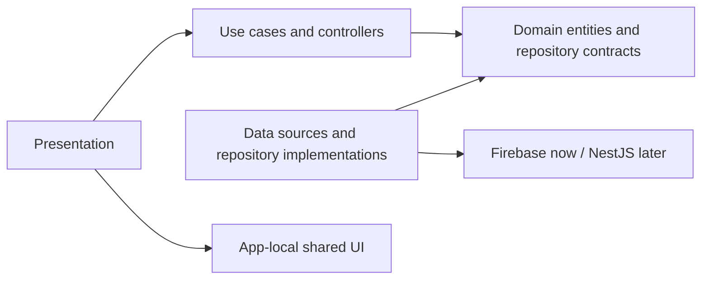
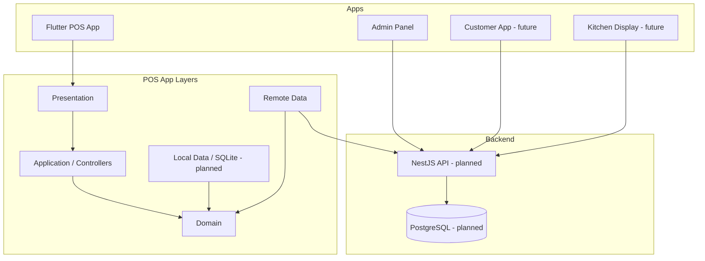

# Repository Restructuring and Refactoring Record

Date: 2026-06-10  
Status: Repository move and architecture increment completed

## 1. Scope and Findings

The repository was analyzed before restructuring. It contained one implemented
project, a Flutter prototype, and two README-only placeholders:

```text
mobile-app/restaurantpos/    Flutter prototype
api/                         Backend placeholder
webapp/                      Admin placeholder
docs/                        Architecture documentation
```

There was no NestJS source, PostgreSQL migration, SQLite database, API client, or
offline synchronization implementation to move or refactor. Those capabilities
remain architecture requirements, not existing code.

The Flutter findings are ranked in
[repository-architecture-audit.md](repository-architecture-audit.md). The most
important remaining risks are:

1. **Critical:** no tenant/outlet context or server-enforced authorization.
2. **Critical:** no SQLite operation queue or offline conflict handling.
3. **Major:** Firebase remains the temporary authentication/profile system.
4. **Major:** admin and service screens remain large presentation prototypes.
5. **Major:** most operational values and workflows remain static demo data.

## 2. Final Repository Structure

```text
restaurant-pos/
  apps/
    pos-app/
      lib/
        app/
        core/
        features/
        shared/
      test/
    admin-panel/
    customer-app/
    kitchen-display/
  backend/
    api/
    database/
    migrations/
    scripts/
  docs/
  infrastructure/
  shared/
```

The root `shared/` directory is for packages consumed by multiple deployable
applications. Flutter widgets used only by the POS application remain under
`apps/pos-app/lib/shared`.

## 3. File Migration Map

### Repository roots

| Previous path | New path | Reason |
|---|---|---|
| `mobile-app/restaurantpos` | `apps/pos-app` | Identify the Flutter client as a deployable application |
| `webapp` | `apps/admin-panel` | Place the future admin client with other applications |
| `api` | `backend/api` | Establish backend ownership and future module boundaries |

### Flutter application

| Previous path | New path | Reason |
|---|---|---|
| `lib/screens/admin/admin_screen.dart` | `lib/features/admin/presentation/screens/admin_screen.dart` | Feature ownership |
| `lib/screens/cashier/cashier_screen.dart` | `lib/features/pos/presentation/screens/cashier_screen.dart` | Feature ownership |
| `lib/screens/waiter/waiter_screen.dart` | `lib/features/service/presentation/screens/waiter_screen.dart` | Feature ownership |
| `lib/screens/auth/login_screen.dart` | `lib/features/auth/presentation/screens/login_screen.dart` | Separate presentation from auth infrastructure |
| Direct Firebase login code | `features/auth/data`, `domain`, and `presentation` | Dependency inversion and testability |
| Three private sidebar copies | `lib/shared/presentation/navigation/app_sidebar.dart` | Remove duplicated application chrome |
| Three private nav item models | `lib/shared/presentation/navigation/app_navigation_item.dart` | One navigation contract |
| Cashier-local menu model | `features/pos/domain/entities/menu_item.dart` | Move business data out of the screen |
| Cashier-local cart calculations | `features/pos/presentation/controllers/pos_controller.dart` | Testable state and rules |
| Cashier-local demo menu | `features/pos/data/demo_menu_catalog.dart` | Isolate temporary data source |
| Floating-point totals | `CartTotals` using integer minor units | Deterministic financial arithmetic |

Removed files were zero-byte placeholders or unreachable duplicate UI. No
business behavior was deleted.

## 4. Flutter Architecture

```text
lib/
  app/
    app.dart
    router/
  core/
    errors/
    formatters/
    theme/
  shared/
    presentation/
      navigation/
  features/
    auth/
      data/
      domain/
      presentation/
    admin/
      presentation/
    pos/
      data/
      domain/
      presentation/
    service/
      presentation/
```

Dependency direction:



Features must not import another feature's presentation layer. Cross-feature
behavior should use application/domain contracts or an app-level coordinator.

## 5. Exact Code Changes

### Application lifecycle and routing

- `main.dart` delegates to `bootstrap.dart`.
- `bootstrap.dart` initializes external SDKs and constructs repository/use-case
  dependencies.
- `MaterialApp.router` and `go_router` own top-level routes.
- Login no longer constructs screens or calls `Navigator` directly.

### Authentication

- `FirebaseAuthDataSource` contains Firebase Auth and Firestore calls.
- `FirebaseAuthRepository` translates provider exceptions into application-safe
  errors.
- `SignIn` validates and normalizes credentials.
- `LoginController` owns loading/error state.
- `LoginScreen` owns only forms, validation display, and role-route selection.

### POS

- `MenuItem` has a stable ID and price in minor currency units.
- `PosController` owns category/search filtering, quantities, cart mutation, and
  tax/service calculations.
- Percentage calculations use integer basis points and explicit half-up rounding.
- `CashierScreen` renders controller state and delegates user commands.
- Demo catalog data is separated so a repository can replace it without changing
  widgets.

### Shared presentation

- `AppSidebar` and `AppNavigationItem` replace three copied private classes.
- Selection behavior remains local to each prototype screen.
- Logout remains intentionally unimplemented because the previous callbacks were
  also empty; session-aware logout belongs in the auth feature.

## 6. Import Update Plan

Completed:

- Router imports point to feature presentation paths.
- Screens import shared navigation through `lib/shared`.
- POS presentation imports domain entities and controller contracts.
- Tests import through the package name, not relative filesystem traversal.
- Documentation and README links use the new repository roots.

Rules for future imports:

- Prefer package imports in tests and public package boundaries.
- Within one feature, relative imports may be used consistently.
- Never import from another app's `lib/`.
- Backend modules must expose public application services rather than database
  entities or controller internals.
- Add automated dependency-boundary linting when the module count grows.

## 7. Dependency Cleanup

Completed:

- Removed unused `flutter_svg`.
- Removed unused `google_fonts`.
- Activated existing `go_router` and `provider` dependencies.
- Regenerated `pubspec.lock`.

Current dependency status:

| Dependency | Decision |
|---|---|
| Firebase packages | Retain temporarily behind auth data boundary |
| `go_router` | Retain for declarative routing |
| `provider` | Retain as low-risk migration bridge |

Riverpod remains the recommended target when the first SQLite-backed repository
is implemented. Introducing it now would create two state systems without proving
the offline architecture.

## 8. Database and Backend Plan

### SQLite client

The future implementation belongs in:

```text
apps/pos-app/lib/core/database/
apps/pos-app/lib/core/sync/
features/<feature>/data/datasources/
```

Requirements:

- Drift/SQLite schema with versioned migrations.
- Local projection tables and a transactional pending-operation queue.
- Device, tenant, outlet, operation ID, base version, and sync cursor.
- Repository contracts hide local/remote coordination.
- Widgets never query SQLite or invoke HTTP directly.

### NestJS/PostgreSQL

The future implementation belongs in:

```text
backend/api/src/modules/<module>/
backend/migrations/
backend/database/
```

Each NestJS module should separate presentation, application, domain, and
infrastructure. PostgreSQL access must be tenant-aware and protected by
row-level security as described in the enterprise system design.

No synthetic backend code was generated because no existing backend behavior or
schema exists to preserve.

## 9. Security Review

Current risks:

- Firebase project configuration is committed. These client identifiers are not
  server secrets, but API restrictions, Security Rules, authorized apps/origins,
  and App Check must be configured.
- Role selection remains client-visible and cannot be treated as authorization.
- Tenant/outlet scope, secure refresh-token storage, MFA, and session restoration
  are not implemented.
- Local cached data is not yet protected because SQLite is not implemented.

Required controls:

- NestJS authorization on every resource operation.
- Tenant and outlet context derived from trusted tokens.
- Short-lived access tokens, rotating refresh tokens, and secure platform storage.
- No PAN/CVV storage.
- Redacted structured logging.
- Encrypted sensitive local fields and remote wipe/revocation support for devices.

## 10. Performance Review

Improved:

- POS logic is independently testable and no longer coupled to object identity.
- Cart entries preserve catalog ordering through stable IDs.
- Shared sidebar removes duplicate widget implementations.

Remaining:

- Controller notifications currently rebuild the full cashier screen, matching
  previous behavior. Split catalog/cart widgets and use selectors next.
- Admin and waiter screens still rebuild broad trees with `setState`.
- Large operational collections will require lazy slivers and pagination.
- No image cache, API cache, indexed local query, or socket lifecycle exists.

## 11. Migration Checkpoints

1. **Checkpoint A - Baseline:** first feature-first/auth refactor validated.
2. **Checkpoint B - Repository roots:** physical directory moves only.
3. **Checkpoint C - Shared navigation:** duplicate sidebars replaced.
4. **Checkpoint D - POS rules:** cart state and money calculations extracted.
5. **Checkpoint E - Validation:** format, dependency resolution, analyzer, tests.

These checkpoints should become separate commits when publishing the branch.

## 12. Risk Assessment

| Risk | Mitigation |
|---|---|
| Tooling assumes old Flutter path | Update CI/IDE commands to `apps/pos-app` |
| Stale generated Flutter metadata after move | Run `flutter pub get`; regenerate platform artifacts if needed |
| Import breakage | Analyzer and tests run from the new path |
| UI regression from shared sidebar | Shared widget preserves dimensions, colors, labels, and selection callbacks |
| Financial behavior changes | Unit tests assert exact minor-unit totals |
| Hidden reliance on deleted empty files | Repository-wide reference search and analyzer |
| Future apps import POS internals | Root `shared/` ownership rule and dependency linting |

## 13. Rollback Strategy

Rollback is checkpoint-based:

1. Revert POS controller extraction while retaining the repository move.
2. Revert shared navigation extraction while retaining feature paths.
3. Move `apps/pos-app` back to `mobile-app/restaurantpos`,
   `apps/admin-panel` back to `webapp`, and `backend/api` back to `api`.
4. Restore README/document references.
5. Run `flutter pub get`, `flutter analyze`, and `flutter test` from the restored
   path.

No database migration or persisted-data transformation occurred, so this
restructure has no data rollback requirement.

## 14. Remaining Roadmap

1. Add session state, route guards, tenant selection, outlet scope, and logout.
2. Split cashier catalog/cart/totals into independently rebuilding widgets.
3. Extract service table/order domain and controller behavior.
4. Extract admin dashboard query models and widgets.
5. Implement Drift, migrations, operation queue, and sync contracts.
6. Scaffold NestJS only when module contracts and initial database migrations
   are ready.
7. Replace Firebase auth repository with NestJS behind the existing domain port.
8. Add CI checks for formatting, analysis, tests, secret scanning, and dependency
   boundaries.

## 15. Final Architecture Diagram


