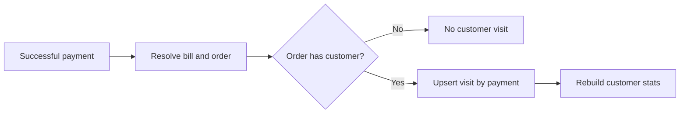

# Customer Management Specification

## Identity And Duplicates

- At least one name, phone, or email identifier is required.
- Display name is generated from first/last name, then phone/email.
- Phone and email duplicates are rejected within a tenant.
- Cross-tenant duplicate contact details are allowed.
- Soft-deleted customers remain historical references.

## Visit Workflow

Each successful partial or split payment records its own spend. Stats count
distinct order IDs, so multiple payments do not inflate order count.

## Stats

Stats include total distinct orders, total successful paid amount, average
order value, first/last visit, and favorite outlet by visit frequency.
Outlet-scoped roles receive history and calculated stats limited to their
authenticated outlet.

## Privacy

- Customer data never crosses tenant scope.
- Full phone/email values must not be written to application logs.
- SMS, email, and WhatsApp opt-ins default to false.
- Bills and receipts retain customer display/contact snapshots for fiscal
  history even if the profile changes.
- Customer self-service is deferred until customer identity ownership is
  explicitly modeled.
