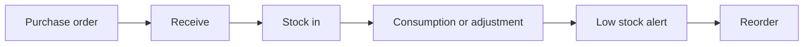
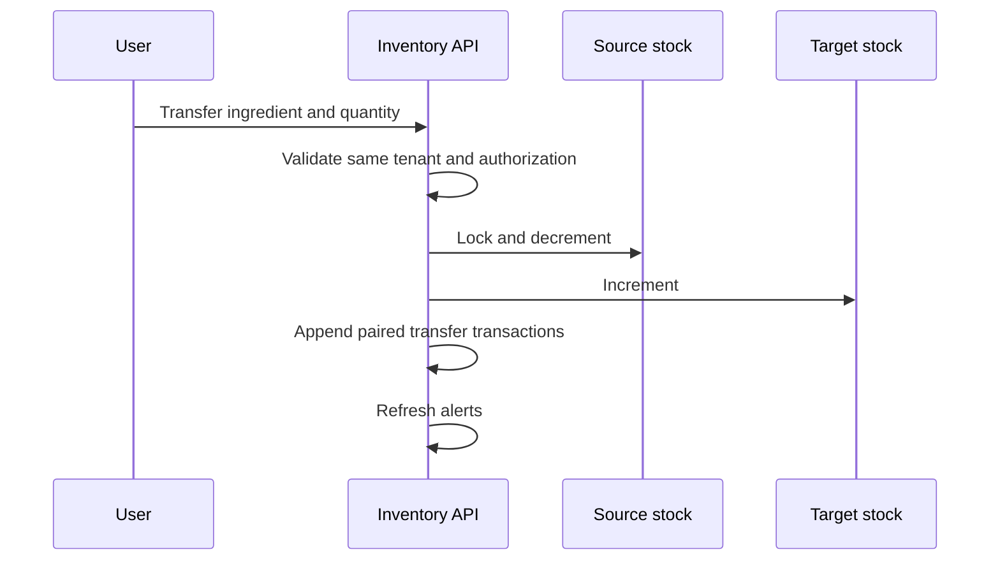

# Inventory Module Specification

## Inventory Workflow



## Stock Adjustment

An authorized user selects an outlet and ingredient, supplies a positive
quantity, adjustment type, and reason. The backend locks the balance, verifies
sufficiency for outgoing movements, updates the balance, appends a transaction,
updates optional batch data, and refreshes alerts atomically.

## Transfer



The transfer rolls back completely if stock is insufficient or either outlet
is outside the tenant.

## Purchase Workflow

Purchase orders progress through:

```text
DRAFT -> PENDING -> APPROVED -> RECEIVED
   \         \           \
    +---------+-----------+-> CANCELLED
```

Draft items may be replaced before finalization. Received and cancelled orders
are immutable. Receipt is single-use and creates a purchase movement for every
line.

## Alerts

- `LOW_STOCK`: available quantity is positive and at/below reorder level
- `OUT_OF_STOCK`: available quantity is zero
- `NEGATIVE_STOCK`: defensive future state
- `EXPIRY_WARNING`: a positive batch expires within 30 days

Stock recovery automatically resolves stock-level alerts. Users may explicitly
resolve operational alerts.

## Valuation

Valuation multiplies current available quantity by the ingredient's current
minor-unit cost and returns per-ingredient and total values. Weighted-average,
FIFO, and landed-cost valuation are deferred.

## Admin Application

The admin inventory feature contains repository-backed Riverpod providers and
screens for dashboard metrics, ingredients, details, adjustments, transfers,
vendors, purchase orders, alerts, and valuation. Widgets do not call Dio
directly.

## Deferred Scope

Recipe definitions and automatic order/kitchen consumption are Task 20. Vendor
invoices, partial PO receipt, batch-level FIFO depletion, and full procurement
approval policies require later explicit contracts.
