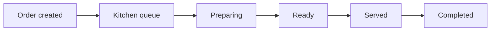

# Kitchen Module Specification

## Purpose

The Kitchen Display System replaces paper kitchen tickets with a real-time,
station-aware operational queue. It supports kitchen staff, managers, waiters,
cashiers, tenant administrators, and explicitly scoped platform support.

## Workflow

Menu items are assigned to outlet kitchen stations. Order creation snapshots a
deterministic primary station on each item. Queue clients can then filter by
station without depending on mutable menu configuration.

## Queue Behavior

- Priority order: urgent, VIP, high, normal.
- Within a priority, older fired items appear first.
- Filters: station, priority, status, and search.
- Projection: order number, table, waiter, items, station, elapsed minutes,
  remaining minutes, and SLA state.
- SLA colors: green for normal, orange for warning, red for critical delay.
- The API bounds a response to 1000 active orders and relies on tenant/station/
  status indexes for filtering.

## Preparation Tracking

Starting, readying, and serving an item records both UTC timestamps and the
authenticated acting user. Ready transitions capture actual preparation
minutes. Queue timers calculate elapsed and remaining minutes at read time.

The metrics endpoint exposes:

- Average preparation time
- Orders completed
- Items completed
- Delayed orders
- Delayed items

Full historical reporting, warehousing, and scheduled aggregation are deferred.

## Realtime Architecture

The authenticated Socket.IO `/kitchen` namespace publishes queue and order
events to tenant, outlet, and station rooms. Room membership is derived from the
authenticated user and revalidated for explicit station/platform subscriptions.
No caller can select an arbitrary tenant room without authorization.

HTTP mutations remain authoritative. Realtime events notify clients to refresh
their server-backed Riverpod projections; they do not replace transactional
validation.

## Restaurant Application

`apps/restaurant-app/lib/features/kitchen` contains:

- Kitchen dashboard
- Kitchen queue screen
- Station management screen
- Kitchen analytics screen
- Riverpod station, queue, metrics, and realtime event providers

Kitchen staff, managers, and tenant administrators can perform authorized
actions. Waiters and cashiers receive read-only queue access. Client role checks
are presentation behavior only; backend authorization remains authoritative.

## Compatibility

The earlier `/kds` category-based API remains available for compatibility.
New development uses `/kitchen` and first-class `KitchenStation` records.
Station routing takes precedence; legacy kitchen categories remain a fallback
and historical contract until a dedicated removal task is approved.
