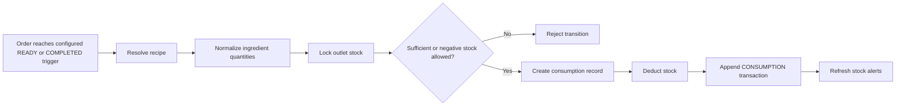

# Recipe And Stock Consumption Specification

## Calculation

A recipe targets a base menu item or a variant. Variant recipes take
precedence; base recipes are the fallback.

```text
normalized = recipeQuantity * inputUnitFactor / ingredientBaseUnitFactor
yieldAdjusted = normalized / recipeYield * portionMultiplier * orderQuantity
consumed = yieldAdjusted / (1 - wastagePercentage / 100)
```

## Consumption



The order transition, consumption records, stock balances, and stock
transactions commit atomically. The unique order-item/ingredient key makes
retries idempotent.

## Cost And Profitability

Ingredient cost uses recent purchase-weighted average cost, with ingredient
master cost as fallback. Recipe cost applies conversion, yield, portion, and
wastage. Changed totals create immutable snapshots. Profitability reports menu
price, recipe cost, gross profit, margin percentage, and food-cost percentage.

## Wastage And Events

Wastage normalizes to the ingredient base unit, snapshots cost, decrements
available stock, increments damaged stock, appends a `WASTAGE` transaction, and
refreshes alerts.

Typed placeholders exist for `RecipeUpdated`, `InventoryConsumed`,
`RecipeCostChanged`, and `InventoryShortageDetected`. Socket.IO transport is
deferred.
